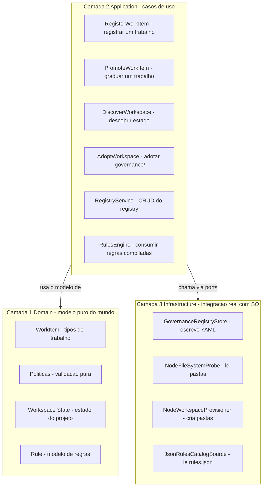
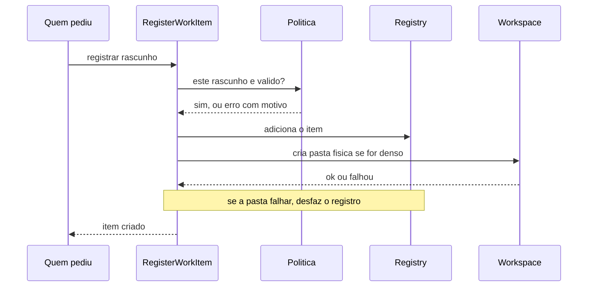
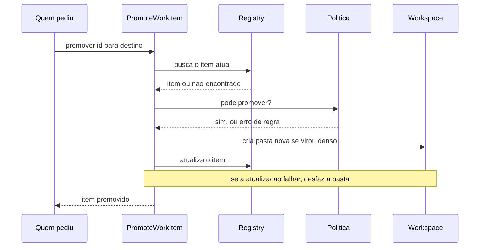
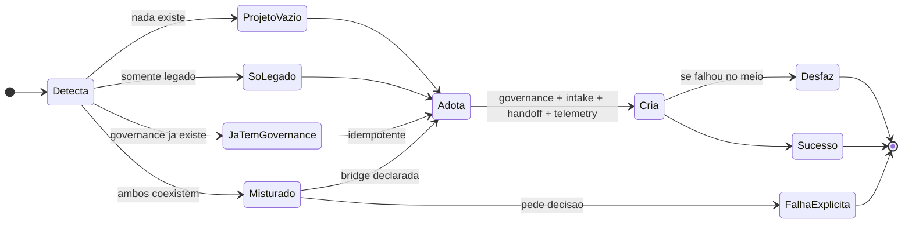

# Como funciona a CLI ai-guidelines

> **Para quem é este documento?**
>
> - **Você é stakeholder, recrutador ou parte do time não técnico?** Leia as seções 1, 2 e 3. Você vai entender **o que** o sistema faz, **por que** ele existe e **onde** estamos no caminho. Sem precisar abrir código.
> - **Você é desenvolvedor entrando no projeto?** Adicione as seções 4, 5 e 6. Ganha contexto suficiente para começar a contribuir.
> - **Você é uma IA ou mantenedor aprofundando?** Comece aqui e siga para [`ARCHITECTURE-REFERENCE.md`](./ARCHITECTURE-REFERENCE.md) — lá vivem o glossário completo, os códigos de erro estáveis, a modelagem detalhada por categoria e as regras de contribuição.
>
> 📊 **Sobre os diagramas:** este documento usa diagramas Mermaid. O GitHub renderiza nativamente. No VS Code, instale a extensão **"Markdown Preview Mermaid Support"** (Matt Bierner) — sem ela o preview mostra apenas o código.

---

## 1. O que esta CLI faz, em uma frase?

A `ai-guidelines` é uma ferramenta de linha de comando que ajuda **times de software a trabalhar com agentes de IA (Claude, GPT, Gemini, Cursor, Copilot…) de forma consistente, governada e auditável**.

Em vez de cada desenvolvedor combinar regras com sua IA preferida no chat, a CLI cria e mantém:

- um **manual único do projeto** (`AGENTS.md`) que descreve as regras e princípios técnicos;
- **versões adaptadas desse manual** para cada IA usada — cada uma com seu formato próprio (Claude tem `CLAUDE.md`, Cursor tem `.cursor/rules/...`, Copilot tem `.github/copilot-instructions.md` etc.);
- um **registro estruturado** (`.governance/registry.yml`) com tudo que está em curso no projeto: specs em andamento, experimentos abertos, correções pendentes, propostas de backlog, incidentes ativos.

**Por que isso importa?**

Quando uma IA "esquece" o contexto do projeto, gera código que viola convenções, ou quando o time inteiro depende da memória de uma pessoa para saber "qual era a regra mesmo?", o trabalho fica caro e frágil. A `ai-guidelines` resolve isso transformando a governança do projeto em **artefatos versionados** — que tanto humanos quanto IAs leem antes de agir.

---

## 2. Cinco princípios que guiam o design

Estas são as regras que o código respeita acima de tudo. Cada uma resolve um problema concreto que apareceu na prática:

1. **Regras de negócio são declaradas, não escondidas.** Cada decisão importante do sistema é um objeto explícito no código — não um `if` perdido em algum script. Trocar uma regra exige editar o lugar certo, e existe um teste que protege a mudança.

2. **O repositório é a memória do projeto.** Tudo que importa — specs, decisões arquiteturais, registros de trabalho — fica versionado no Git. Não há banco de dados externo, dashboard mágico ou cache que se perde. Se está no Git, é verdade. Se não está, não existe.

3. **Os testes são a documentação executável.** Cada regra do sistema (`[BR-CLI-*]`) tem um teste que descreve o comportamento esperado. Quando o teste muda, a doc derivada muda junto. Não existe "documentação desatualizada" porque a documentação **é** o teste.

4. **O código respeita camadas claras.** Três zonas com responsabilidades bem definidas: regras puras na camada mais profunda (Domain), coordenação no meio (Application), integração com o sistema operacional na borda (Infrastructure). Cada camada tem o que pode e o que não pode tocar — isso é verificado automaticamente pelo pipeline de CI.

5. **Nada acontece sem a política aprovar.** A CLI nunca escreve um arquivo ou registra um item antes de a "política" do domínio dar OK. Se a regra de negócio diz "não pode", nenhum efeito colateral acontece. Isso evita o cenário "registrei meio-caminho, agora o estado tá inconsistente".

---

## 3. Como o código está organizado

O código fica em `src/`, dividido em **três camadas concêntricas**. Quanto mais "interna" a camada, mais pura ela é — sem chamadas ao disco, à rede ou ao relógio.

### Glossário rápido (linguagem do projeto)

Quando você lê código ou docs deste projeto, alguns termos se repetem. Aqui estão os essenciais traduzidos em português direto:

| Termo técnico                 | O que significa no projeto                                                                                                                                            |
| ----------------------------- | --------------------------------------------------------------------------------------------------------------------------------------------------------------------- |
| **Domain** (Camada 1)         | O "modelo do mundo" — conceitos como "o que é um trabalho", "quando uma proposta pode virar spec". Sem disco, sem rede, sem relógio. Funções 100% previsíveis.        |
| **Application** (Camada 2)    | A camada que coordena os casos de uso (registrar, promover, descobrir, adotar). Não conhece detalhes técnicos.                                                        |
| **Infrastructure** (Camada 3) | A implementação concreta: aqui mora o código que escreve arquivos YAML, lê o filesystem, etc.                                                                         |
| **Bounded context**           | Um pedaço do código com responsabilidade bem delimitada. Ex: "tudo sobre workspace" vive junto. Permite que duas pessoas mexam em partes diferentes sem se atropelar. |
| **Port**                      | Uma interface — um "contrato" do que precisa ser feito, sem dizer como. Ex: "preciso saber se este diretório existe".                                                 |
| **Adapter**                   | A implementação concreta de um port — o "como". Ex: "uso `node:fs` para verificar se o diretório existe".                                                             |
| **WorkItem**                  | Um item de trabalho registrado. Pode ser uma `spec`, `experiment`, `exploration`, `incident`, `proposal`, `patch` ou `fix`. Sete tipos, mutuamente exclusivos.        |
| **Policy** (Política)         | Uma função pura que decide se uma ação é válida. Ex: "uma proposta pode virar spec?" → política responde sim ou não, com motivo.                                      |
| **Registry**                  | O "livro-razão" do projeto — lista todos os WorkItems ativos. Versionado em `.governance/registry.yml`.                                                               |
| **`.governance/`**            | A pasta canônica onde a CLI armazena o estado estruturado do projeto do usuário. Contém o registry e reservas para futuras adições (intake, handoff, telemetry).      |

---

## 4. Os três fluxos principais

Estes são os caminhos que o sistema percorre quando o usuário ou a IA pede algo importante.

### 4.1 Registrar um trabalho novo

Quando alguém pede "registre uma nova spec X":

**Ordem:** **primeiro** o registro lógico, **depois** a pasta física. Se a pasta falhar, desfaz o registro. Garantia: o sistema nunca fica em estado meia-boca (item registrado mas pasta inexistente, ou vice-versa).

### 4.2 Promover um trabalho

Algumas transições são canônicas: uma `proposal` pode virar `spec`, um `experiment` que venceu pode virar `spec`. Outras (como promover um `patch` ou `fix`) são proibidas por design.

**Ordem invertida** comparada ao Register: aqui é **primeiro** a pasta, **depois** o registro. Motivo: se já existe um item marcado como `spec` no registro mas a pasta correspondente não foi criada, fica pior do que o cenário oposto (pasta vazia sem item — fácil de limpar).

Cada caso de uso escolhe a ordem que **minimiza o estado inválido específico dele** — não há "regra única de ordem" que sirva para tudo.

### 4.3 Adotar a estrutura `.governance/` no projeto do usuário

Quando alguém roda `ai-guidelines adopt` em um projeto existente, o sistema precisa primeiro **detectar o estado atual** e então decidir o que fazer:

**Sem comportamento mágico.** Se o projeto tem **ao mesmo tempo** as pastas antigas (`.specify/`, `.ai-guidelines/`) e a nova (`.governance/`), o sistema **falha com uma mensagem clara** pedindo decisão explícita — nunca tenta "adivinhar" qual é a SSOT (single source of truth, "fonte única da verdade").

---

## 5. As 12 garantias do sistema

Estas são propriedades que o pipeline de CI verifica automaticamente. Se alguma é quebrada, o build falha — código não chega no `main`:

| #   | Garantia                             | Em palavras simples                                                 |
| --- | ------------------------------------ | ------------------------------------------------------------------- |
| 1   | Domain puro                          | A camada 1 nunca chama as camadas 2 ou 3                            |
| 2   | Application só via ports             | A camada 2 nunca chama a camada 3 diretamente                       |
| 3   | Policy-first                         | Toda mudança passa pela validação antes de qualquer efeito          |
| 4   | Atomicidade bilateral                | Se algo falha no meio do processo, desfaz tudo                      |
| 5   | Registry é fonte de verdade          | IDs são únicos e imutáveis; o tempo é controlado                    |
| 6   | Tipos de trabalho são MECE           | 7 tipos exclusivos; impossível misturar campos cruzados             |
| 7   | YAML é o estado real                 | `.governance/registry.yml` é o estado canônico versionado           |
| 8   | Anti-drift estrutural                | Código e documentação não podem divergir silenciosamente            |
| 9   | Workspace tem precedência explícita  | Sem alias mágico, sem fallback invisível                            |
| 10  | Rollback nunca destrói nada          | Desfazer só apaga o que este run criou                              |
| 11  | Topologia reflete taxonomia          | Regras em `.core/rules/` organizadas em `top/center/base/adapters/` |
| 12  | Contrato do usuário é `.governance/` | `.ai-guidelines/` é uma "ponte legada" declarada explicitamente     |

Detalhe técnico completo de cada garantia (motivação, contraexemplos, testes que protegem): ver [`ARCHITECTURE-REFERENCE.md`](./ARCHITECTURE-REFERENCE.md) §2.

> **MECE** = Mutuamente Exclusivos e Coletivamente Exaustivos. Significa que cada item se encaixa em **exatamente uma** categoria, e o conjunto das categorias cobre **todos os casos possíveis** — nada cai entre as cadeiras, nada se sobrepõe.

---

## 6. Roadmap — onde estamos

A Spec 0021 leva o framework do paradigma "Spec-Driven" (centrado em specs formais) para "Governance-Driven" (governança como um todo, com 7 tipos de trabalho de primeira classe). A entrega é fatiada em 5 etapas atômicas:

| Etapa   | Tema                                                                                         | Estado       |
| ------- | -------------------------------------------------------------------------------------------- | ------------ |
| **PR0** | Setup do projeto + decisões iniciais aprovadas pela owner                                    | ✅ Concluído |
| **PR1** | Fundação: modelo de domínio + políticas + registry em memória                                | ✅ Concluído |
| **PR2** | **Este PR.** Persistência real em disco + camada de migração + reorganização das regras      | ✅ Concluído |
| **PR3** | Documentação viva derivada dos testes + engine de templates atômicos                         | ⏭️ Próximo   |
| **PR4** | Cleanup final + migração definitiva `.ai-guidelines/` → `.governance/` no projeto do usuário | ⏭️ Pendente  |

Hoje a CLI **continua escrevendo em `.ai-guidelines/`** no projeto do usuário (compatibilidade preservada). O novo formato `.governance/` é o contrato canônico declarado, materializado no código de domínio — a migração real do **comportamento da CLI** acontece em PR4.

---

## 7. Para aprofundar

- **Detalhes técnicos densos** (glossário completo do domínio, códigos de erro estáveis, modelagem por categoria de pilar, justificativa de discriminated union vs herança, boundary enforcement, convenções de topologia, como contribuir com a arquitetura): [`ARCHITECTURE-REFERENCE.md`](./ARCHITECTURE-REFERENCE.md).
- **Decisões arquiteturais ancoradas** (cada `[DEC-0021-*]` com opções avaliadas e justificativa documentada da owner): `.specify/specs/0021-governance-information-architecture/decision-brief.md`.
- **Roadmap operacional detalhado** (sub-blocos por PR com critérios de aceite, checklists e dependências): `.specify/specs/0021-governance-information-architecture/tasks.md`.
- **Auditorias internas e débitos conscientes** (o que foi avaliado, o que ficou para depois, com motivo): `.specify/specs/0021-governance-information-architecture/NEXT.md`.

---

> **Princípio editorial.** Este documento é a **entrada principal** para humanos. Quando uma seção precisaria explicar detalhes técnicos densos (glossário completo, códigos de erro, edge cases), o detalhe vive em `ARCHITECTURE-REFERENCE.md`. Se uma seção aqui cresce mais que ~30 linhas, mova o excedente para o reference.
