# Modelo do trabalho (grafo) — arquivo único de acompanhamento

> **Este é o ÚNICO arquivo de acompanhamento.** (Juntei os dois; o `model-analysis-workbench` foi removido.)
> **🔴 = pergunta aberta · 🟢 = já decidido.** Iteramos aqui, uma de cada vez.
> Regras nossas: **recência vence** (a decisão mais nova supera a antiga) e **conferir o já-decidido antes de
> desenhar**. Não-autoridade; vira insumo da DEC quando fechar.

---

## Parte 1 — O modelo, em 5 lentes (referência)

### Lente 1 · Os tipos: 5 de TRABALHO + 2 FERRAMENTAS (`proposal` · `exploration`)

O que separa um tipo do outro é a **intenção de saída** — _o que o autor quer que aconteça no mundo ao concluir
o item_ (não tamanho/tecnologia/estágio).

> **🟢 Decidido (owner 2026-06-25) · REFINADO (2026-06-27):** o **TRABALHO** são **5 tipos** — `delivery` ·
> `experiment` · `incident` · `fix` · `patch` (entregam **valor de produto**). O **`spike` saiu dos tipos de
> trabalho** e virou **FERRAMENTA** (junto do `proposal`) — instrumentos do ciclo todo que **servem** o trabalho,
> sem entregar valor de produto por si (ver **Lente 4**; **renomeado `spike` → `exploration`**). **Dense ×
> Virtual caiu:** a densidade **escala com o peso de CADA instância**, não por tipo; só os **campos exigidos**
> (hipótese/métricas no experiment; severidade no incident) são por tipo (parte da intenção).

Para cada tipo: **o que entrega · de onde surge · o que exige · abre→investiga→fecha · resultado vem depois? ·
vira outro? · o que o torna único.**

**`delivery`** (ex-`spec`) — _construir o que já foi decidido_

- **Entrega:** muda a **capacidade** do sistema.
- **Exige:** nada além do intent · **densidade escala com o peso** (geralmente densa).
- **Abre→investiga→fecha:** `delivery-brief` **selado** → questions/research (se houver pergunta aberta) → **gate** (a prova é o próprio merge).
- **Resultado depois?** opcional — verificar se a entrega moveu o valor.
- **Vira outro?** não — é **destino** (proposta e experimento-won viram delivery).
- **Único:** o trabalho "padrão"; o valor **é** a capacidade entregue; **comprometido** (fica — _pode_ ser
  removido no futuro, mas isso **não é o core**).

**`experiment`** — _intervir pra aprender sobre uma tese_

- **Entrega:** **qualquer intervenção no produto pra APRENDER** sobre uma tese — A/B (controle × variante) **ou**
  **rollout medido** (liberar pra uma fatia e medir). **Não** é só teste A/B. O valor **é o aprendizado**.
- **Exige:** **hipótese + métricas** (por tipo) · **ideal:** atrás de **feature flag** (pra desligar/remover a
  qualquer hora) · densidade escala com o peso.
- **Abre→investiga→fecha:** `experiment-brief` que **sela a hipótese** → discovery (questions/research; pode disparar `exploration`) → gate no merge — **mas o resultado vem depois**.
- **Resultado depois?** **SIM** — roda um período → **won / lost / inconclusivo**. _(Em growth, **lost > won é
  saudável** — taxa de sucesso alta demais = só ideias óbvias, pouco risco.)_
- **Vira outro?** **won → delivery** (sistematiza), com **flexibilidade**: hoje (com IA) **reaproveita-se bem mais
  o código testado** do que antes (quando won = refatorar muito). `lost` → clean-up; `inconclusivo` → itera.
- **Único:** o **único cujo valor só se conhece depois do merge**, e que se **espera perder com frequência**.

_(↓ O que era `spike` **saiu daqui** — virou a ferramenta **`exploration`**, descrita na seção FERRAMENTAS abaixo, junto do `proposal`.)_

**`incident`** — _conter um problema grave (sem culpa, sem débito)_

- **Entrega:** **contém e documenta** uma fricção grave, com **severidade**. O valor está em **não repetir** (prevenção).
- **Cultura:** **blameless** — não é sobre "quem causou". _(owner: **não** queremos que as pessoas tenham medo de lidar com incidentes.)_
- **Abre (rápido, simples):** um **template simples/interativo** registra o incidente (severidade · o que quebrou
  · status). Esse registro **destrava barreiras com PRAZO** — prioridade de merge, bypass de CI — pra **apagar o
  incêndio sem virar débito** (o bypass **expira**; `GG-0005`).
- **Investiga/corrige:** mitiga → mergeia rápido (com o bypass).
- **Fecha:** **postmortem** (causa-raiz + ações + prevenção). **Leve** (pra dar vontade de fazer) **mas garantido**
  por um **alerta** atrelado ao prazo (pra não despriorizar). É o artefato principal; doc vivo.
- **Vira outro?** não (terminal) — mas **gera prevenção:** um `fix` (correção definitiva), um `patch` (hardening) ou uma `proposal`.
- **Único:** o **único reativo** — age antes, documenta depois.

**`fix`** — _corrigir um bug que o usuário vê_

- **Entrega:** corrige um comportamento **que o usuário percebe**.
- **De onde surge:** **diverso** — bug reportado (cliente/interno, **prioridade menor que um incident**); de uma
  `proposal`; ou **percebido durante** outro trabalho (`patch`/`experiment`/`delivery`).
- **Tamanho:** **varia** — de 1 linha a algo que precisa de **investigação** (uma `exploration`) ou que **cresce e vira
  `delivery`**. ⚠️ Pode **merecer registro próprio**, não só uma linha — **subestimamos o fix** (owner 2026-06-25).
- **Exige:** nada · **densidade escala com o peso** (de 1 linha a registro próprio).
- **Abre→fecha:** registro (leve _ou_ próprio) → commit → verifica.
- **Único:** o discriminador vs `patch` é **"o usuário vê"**; o **tamanho não** define o tipo.

**`patch`** — _manutenção invisível ao usuário_

- **Entrega:** manutenção **que o usuário NÃO vê** (deps, lint, refactor transparente, segurança).
- **De onde surge:** **diverso** (igual ao fix) — necessidade de manutenção (bump de dep, lint, security);
  **dívida técnica percebida durante** outro trabalho (`delivery`/`experiment`); de uma `proposal`. Standalone ou atrelado.
- **Tamanho:** **varia** — de um bump de 1 linha a um **refactor grande / migração arriscada** que precisa de
  **investigação** (uma `exploration`) ou que **cresce e vira `delivery`** (a zona cinza "refactor que passa a mudar capacidade").
  Pode **merecer registro próprio**.
- **Exige:** nada (sem hipótese/severidade — não é experiment nem incident) · **densidade escala com o peso**.
  ⚠️ "não ter hipótese/severidade" **≠** "não ter registro".
- **Abre→fecha:** registro (leve _ou_ próprio) → commit → verifica.
- **Único:** o que o separa do `fix` é **só a visibilidade** (o usuário **não** vê); o tamanho não define o tipo.
  Quando o "refactor transparente" **passa a mudar capacidade**, deixa de ser patch → vira `delivery`.

---

**Fora dos tipos de trabalho — as FERRAMENTAS (Lente 4):** instrumentos do **ciclo todo** que **servem** o trabalho; **não** entregam valor de produto por si. São **duas** — `exploration` (investigação) e `proposal` (intake).

**`exploration`** _(ex-`spike`)_ — _a ferramenta de investigação: provar/responder um ponto antes de entregar valor_

> **🟢 Decidido (owner 2026-06-27):** o que era `spike` **não é tipo de trabalho** — é **ferramenta** (como o `proposal`/`insight`), usada **antes ou durante** o trabalho pra **produzir conhecimento** (valor de **aprendizado**). **Renomeado `spike` → `exploration`** (cobre exploration/POC/pesquisa/benchmark). É **executada** (tem ciclo de vida próprio), mas **não** entrega valor de produto.

- **Entrega:** **prova/responde um ponto** (técnico ou de modelagem) por investigação → **valor de aprendizado** (às vezes robusto: POC, ou templates/base que o trabalho seguinte herda via `derives-from`).
- **De onde surge:** **amplo** — standalone (validar algo / POC), ou dentro de um `delivery`/`experiment`, ou de uma `proposal`.
- **Exige:** um **timebox** · densidade escala com o peso.
- **Abre→investiga→fecha:** a **investigação É a ferramenta em uso** → **prova o ponto** → fecha em `exploration-answer` (ex-`spike-answer`).
- **3 destinos da saída (decidido 2026-06-25):** o eixo é **"tem casa / priorizado agora?"** → (1) **jogável** → morre (PR sem merge; aprendizado → answer); (2) **durável com casa** → promove pro home (ex.: `_templates/`); (3) **valioso sem casa** → **parqueado na pasta da exploration** + uma **`proposal`** aponta pro **backlog** (descongela quando priorizado). O **`exploration-answer`** indexa tudo.
- **Leva a outro?** pode **levar a** `delivery`/`experiment`/`fix`, ou **nada** (descartado).
- **Único:** o único de **PURO aprendizado**; **nasce em qualquer lugar** e **serve qualquer entrega** — por isso **ferramenta, não tipo**.

**`proposal`** — _a ferramenta que captura ideias/problemas durante o trabalho_

> **🟢 Decidido (owner 2026-06-25):** `proposal` **não é um tipo de trabalho** — é uma **ferramenta** (como o
> `insight` já é) usada **durante** o trabalho pra capturar uma ideia/problema que você **não pode parar** ou
> **não tem autoridade** pra resolver, num **registry dedicado** que alimenta o backlog. Muda a ADR 0010 (execução depois).

- **Entrega:** registra uma **ideia ou problema** pra não se perder — ainda **sem ciclo formal**.
- **De onde surge:** **qualquer lugar** — percebido durante outro trabalho (delivery/experiment/exploration/patch) e
  aberto **em paralelo** sem travar, ou registrado standalone (ideia de backlog). _(o "trabalho" inclui a ferramenta `exploration`.)_
- **Não percorre o fluxo:** é uma ideia **parada**, esperando triagem — não investiga/decide/executa por si.
- **Triagem (anti-buraco-negro):** status (open/promoted/dismissed) · dono · **disposição obrigatória**
  (promove ou descarta com motivo). Reusa o **padrão** do `insight` (separado dele). **Captura HUMANA, a QUALQUER momento** (não auto do verdict); **2 triagens:** captura (nasce) + disposição (owner promove/descarta); `raised-from` = proveniência. _(sim v2: dashboard `/propostas` filtrável por time/ICE/tag.)_
- **Vira outro?** **qualquer tipo** (delivery/experiment/fix/patch) ou **descartado**. Se precisa investigar antes → vira uma `exploration`.
- **Densidade:** **leve por natureza** — não é trabalho ainda, é ideia parada; o peso só aparece **ao promover**
  (no tipo que vira). Leve **porque é pré-trabalho**, não por regra estrutural.
- **Alimenta o backlog:** versão de **1ª classe e unificada** do que hoje está espalhado em `NEXT.md`,
  `insights`/PIT e o artefato `gap` → `roadmap/backlog.md` (ver 🔴 conectar tudo isso).
- **Único:** é o **intake** do sistema; alimenta tudo **promovendo**.

### Lente 2 · O ciclo de vida (momentos pelos quais o trabalho passa)

> 🔴 obrigatório (o framework **reclamaria** se faltar) · 🟡 opcional (apoia, nunca trava) · ✦ **coração** · `nomes` = documento · _itálico_ = ação.

| tipo           | abrir                 | investigar/decidir ✦                | executar   | entregar            | acompanhar               |
| -------------- | --------------------- | ----------------------------------- | ---------- | ------------------- | ------------------------ |
| **delivery**   | 🔴 `delivery-brief`   | 🟡 `question`·`research`·`decision` | 🔴 _fazer_ | 🔴 _merge_          | 🟡 _verificar_           |
| **experiment** | 🔴 `experiment-brief` | 🟡 `question`·`research`·`decision` | 🔴 _fazer_ | 🔴 _merge_          | 🔴 `experiment-outcome`  |
| **incident**   | 🔴 `incident-brief`   | 🟡 `question`·`research`·`decision` | 🔴 _fazer_ | 🔴 _merge (bypass)_ | 🔴 `incident-postmortem` |
| **fix**        | 🔴 `fix-brief`        | 🟡 `question`·`research`·`decision` | 🔴 _fazer_ | 🔴 _merge_          | 🟡 _verificar_           |
| **patch**      | 🔴 `patch-brief`      | 🟡 `question`·`research`·`decision` | 🔴 _fazer_ | 🔴 _merge_          | 🟡 _verificar_           |

_(As **ferramentas** (Lente 4) **não** estão na tabela — alimentam o trabalho, não percorrem o ciclo DELE: `proposal` é intake (parado); `exploration` é **executada** e tem **seu próprio ciclo** (abre→investiga→`answer`), descrito na Lente 1. **Sumiu a categoria ⚪ "pula"** — ela só existia por causa da exploration, e mostra o quanto ela era diferente dos trabalhos.)_

> _fazer_ (`executar`, 🔴 sempre): produzir o que realiza o intent — **ação, não documento**. Geralmente **código**; pode ser **doc** (ex.: `exploration` de análise, patch de documentação), **config**, **dados/migração** ou **infra** — depende do tipo + instância.
>
> _merge_ (`entregar`, 🔴 sempre): **todos** os 5 trabalhos merjam a saída; o `incident` merja com **bypass-com-prazo**. _(A ferramenta `exploration` também fecha mergeando o `exploration-answer` + duráveis — só o PoC jogável morre sem merge; ver os 3 destinos na Lente 1.)_

> ✦ **Coração do framework** = `question` → `research` → `decision` (a família **DELIBERAÇÃO**, Lente 4): 🟡 (opcional, sem lint) **mas é onde está o valor** — pular é permitido e você ainda entrega, mas **abre mão dos benefícios** (rastro de decisão, apoio ao julgamento, grafo de raciocínio). O framework **sinaliza o trade-off**, não o esconde.
>
> ✅ **Lente 2 fechada** (decididos na Parte 3) — **REFINADA 2026-06-27:** a `exploration` (ex-spike) saiu da tabela (é ferramenta) e a categoria ⚪ "pula" foi **removida** (só existia por ela). ⚠️ O SVG `../assets/work-types-lifecycle-paths.svg` precisa ser **regenerado** (5 linhas, sem ⚪).

### Lente 3 · As ligações entre trabalhos (o grafo)

A lista de ligações está **fechada: 10 arestas, cada uma com 1 critério único** — elas **conectam as famílias da Lente 4** (grafo completo em [`../assets/lente3-edge-graph.svg`](../assets/lente3-edge-graph.svg)):

| Aresta                        | Categoria    | Critério (o teste único)                                                                               |
| ----------------------------- | ------------ | ------------------------------------------------------------------------------------------------------ |
| `breaks-into`                 | estrutura    | intent/entrega → suas PARTES                                                                           |
| `derives-from` ⟷ `results-in` | proveniência | B se baseia na SAÍDA de A (consumido × persiste = status do NÓ)                                        |
| `raises`                      | proveniência | trabalho levanta um `proposal`                                                                         |
| `blocked-by` ⟷ `blocks`       | dependência  | espera um TRABALHO concreto concluir                                                                   |
| `depends-on`                  | dependência  | depende de PLATAFORMA/VERSÃO/build                                                                     |
| `coordinates-with`            | dependência  | o CONTRATO comum que coordena (nome na intent); work↔work = blocked-by/blocks                          |
| `answers`                     | investigação | a exploration DECLARA a `question` que responde (→ `answered`; `resolved` exige a `decision` = o GATE) |
| `supported-by`                | investigação | `decision` se apoia na sua EVIDÊNCIA                                                                   |
| `closed-by`                   | fecho        | trabalho → seu ARTEFATO DE FECHO (answer/outcome/postmortem)                                           |
| `supersedes`                  | histórico    | `decision` nova substitui a antiga                                                                     |

**Casa de cada aresta — qual DOCUMENTO a ancora** (regra: anota-se **1 lado**, o reverso é **derivado** — materializado **no BANCO** (a projeção/dashboard é onde se lê), **não** duplicado no arquivo-fonte (que fica só INPUT); ex.: o `answered-by`/`verdict` o banco deriva da exploration; **docs de CONTEÚDO — briefs, artefatos de fecho e a cadeia q/r/d (`question`/`research`/`decision`) — não carregam aresta**: quem ancora é o ÍNDICE/MAPA (`registry` · `deliberation.yml`) ou a ESTRUTURA (`intent` · `proposal`)):

| Documento                             | Ancora (anota 1 lado)                                                           | Derivadas (deduz o reverso)                                                | Nota                                                                                                                                                     |
| ------------------------------------- | ------------------------------------------------------------------------------- | -------------------------------------------------------------------------- | -------------------------------------------------------------------------------------------------------------------------------------------------------- |
| **registry** (work)                   | `blocked-by` · `depends-on` · `coordinates-with` · `derives-from` · `closed-by` | `blocks` · `results-in` · `raises`                                         | `coordinates-with` → CONTRATO (não simétrica work↔work); `closed-by`/`coordinates-with` são por-kind (ver abaixo)                                        |
| **exploration** (registry)            | `derives-from` · `closed-by` · `answers`                                        | `results-in` · `raises`                                                    | declara **`answers: intent#qN`** (a intent deriva `answered-by`, A+); **sem agendamento** — um bloqueio que ela acha vira a RESPOSTA                     |
| **intent** (`intent.yml`)             | — _(input puro: `open-questions`·`contracts`)_                                  | `breaks-into` (via back-ref dos works) · `answers` (via `answered-by`, A+) | `breaks-into` = vista **DERIVADA** agrupada por status; `answered-by`/`status`/`verdict` das open-questions = DERIVADOS (A+) do `answers` da exploration |
| **proposal** (`proposal.yml`)         | `raises` (via `raised-by`)                                                      | —                                                                          | intake; o `raises` do work/exploration é o derivado                                                                                                      |
| **deliberation** (`deliberation.yml`) | `supported-by` · `supersedes`                                                   | —                                                                          | só o MAPA carrega aresta; `question`/`research`/`decision` = conteúdo                                                                                    |

**Por-kind — as arestas do work NÃO são universais** (confirmado ao tirar a antiga spike):

- **`closed-by`** → só quem tem **fecho denso**: `experiment` (→ outcome) · `incident` (→ postmortem). `delivery` fecha no **gate** (sem doc); `fix`/`patch` só "done". _(a `exploration` também tem, → answer.)_
- **`coordinates-with`** → principalmente `delivery`/`experiment` (contratos cross-repo); reativos (`incident`/`fix`/`patch`) **raramente**.
- **`blocked-by`/`depends-on`/`derives-from`/`results-in`** → **opcionais a todos os 5** (incident é reativo/urgente → raramente espera).
- _(a lista por-kind dessas diferenças mora no `registry-entry.yml`, junto dos campos próprios de cada kind.)_

Exemplos vivos **não ficam aqui** — moram em `_templates/`, `_archive/repo-simulation-v1/` e `../assets/` (diagramas).

**Cross-repo + camada `intent` (modelo maduro — detalhe na Parte 3 e em [`2026-06-26-cross-repo-feature-graph.md`](2026-06-26-cross-repo-feature-graph.md)):** as arestas cross-repo (`coordinates-with`/`depends-on`) vivem **nas entregas** e resolvem em **contratos** (`coordinates-with` = compartilhar um contrato · `depends-on` = esperar um build/versão). **Acima** dos trabalhos há a camada **`intent`** (objetivo durável) que **`breaks-into`** N trabalhos e se **retroalimenta** via `answers` (resolução derivada) + `breaks-into`. Intent **multi-repo** → **registry cross-repo** (plano autorado + banco derivado → dashboard).

### Lente 4 · As famílias de artefatos (a convergência do sistema)

> Acima dos tipos (Lente 1): **3 famílias** de artefatos — é o que começa a **cravar o sistema**.

| Família         | Membros                                                      | O que é                                               | Arquivos próprios                                                                                                                                                   |
| --------------- | ------------------------------------------------------------ | ----------------------------------------------------- | ------------------------------------------------------------------------------------------------------------------------------------------------------------------- |
| **TRABALHO**    | `delivery` · `experiment` · `incident` · `fix` · `patch` (5) | entrega **valor de PRODUTO**                          | `registry` (índice) + `brief` (abertura) + `closing` (fecho)                                                                                                        |
| **FERRAMENTAS** | `proposal` · `exploration` _(ex-`spike`)_                    | instrumentos do **ciclo todo**; **servem** o trabalho | `proposal`: só `registry` (intake, não executado) · `exploration`: `registry`+`brief`+`closing` (executada → valor de **aprendizado**)                              |
| **DELIBERAÇÃO** | `question` · `research` · `decision`                         | o **raciocínio** (q→r→d, o ✦ coração da Lente 2)      | os 3 + um **mapa VIVO** (**`deliberation.yml`**, renomeado de decision-brief; lista APPEND-ONLY de decisões-nó: `decides`/`supported-by`/`results-in`/`supersedes`) |

**Transversais** (não são família — ligam tudo): **`intent`** (o objetivo, acima do trabalho) · **`state`** (cursor/topologia) · os **`registries`** (índices derivados).

**Os FECHOS** (`exploration-answer` · `experiment-outcome` · `incident-postmortem`) **não são uma 4ª família** — são a **face de CONTEÚDO DE FECHO** de trabalho & exploration, **espelho do `brief`** (abertura ↔ fecho); vivem em `closings/`. Papel especial: são a **ponte** onde a execução **vira conhecimento** que alimenta a deliberação (`answer` → responde uma `question` · `outcome` → vira `decision` won/lost · `postmortem` → vira aprendizado).

**Decidido (owner 2026-06-27):** ✅ `spike` → **`exploration`** · ✅ **fecho = face** (não 4ª família, confirmado). · ✅ **`deliberation` × `state` (framing decidido 2026-06-28):** **camadas distintas, nenhum absorve o outro** (`deliberation` = decisões · `state` = cursor/topologia, command-driven, **referencia** o deliberation); ambos na camada **INTERNA** do repo — ver **Lente 5** + Parte 2. · ✅ **Propagação do rename** `spike`→`exploration` — **feita** nos arquivos (templates + `_org-simulation` + prosa do tracker); falta só os **SVGs** (redraw).

### Lente 5 · As CAMADAS: governança (grafo de registries) × conteúdo

> Insight owner 2026-06-27. As lentes 1-4 falam de tipos/ciclo/arestas/famílias; esta separa **CAMADAS** — e **subsome a rodada dos bancos** (🔴🔥).

A **governança** é um **grafo de REGISTRIES** — o que uma **app/form de intents** criaria/salvaria (num **banco** OU em **arquivos** do repo: backend **plugável**, do dev solo à escala). Os registries: **`intent`** · **work-registries** · **`exploration`-registry** · **`proposal`** · **`deliberation`-map**. Eles **só se comunicam com outros registries** (as arestas da Lente 3) → formam o **board/dashboard** consultável.

O **CONTEÚDO** (briefs · closings/answers · texto do q/r/d) **vive à parte**, **referenciado** pelos registries — é o que se lê ao **abrir** um nó, não o que o grafo **consulta**.

| Camada         | O que é                                         | Onde mora                    | Quem cria                                     |
| -------------- | ----------------------------------------------- | ---------------------------- | --------------------------------------------- |
| **GOVERNANÇA** | grafo de registries (índice + arestas + estado) | banco OU arquivos (plugável) | a app/form (modelamos só **o que ela salva**) |
| **CONTEÚDO**   | briefs · answers · texto do q/r/d               | arquivos (no repo/workspace) | a pessoa, ao **abrir** o nó                   |

**Decidido na sim v2 (2026-06-27 — supersede a forma antiga de 274/278):** a amarra intent↔exploration = a **exploration declara `answers: intent#qN`** (qualificado, cross-repo); a intent **deriva** `answered-by`/`status`/`verdict` (**A+**, check anti-drift); contratos = UMA lista `[{name, awaits?}]` (known/pending **derivado**, sem baldes); saiu o `unlocks` (destrave derivado). **Provado rodando** pelos bancos TS (`_banks/`): fechar a exploration → q **`answered`** (evidência); o **GATE** (`decision` humano aceita, `supported-by` o answer) → q `resolved` → contrato `known` → deliveries destravam. **Decidido (enxugar, 2026-06-27):** o `intent.yml` fica só **INPUT** (título/objetivo/refs · `open-questions {id,question}` · `contracts`); o DERIVADO (`answered-by`/`status`/`verdict`/`breaks-into`) o **BANCO** projeta — não duplica no arquivo. Resolve o `embute × referencia`: **input no arquivo, derivado no banco**.

**Decidido (owner 2026-06-28) — o LAYOUT físico do backend "arquivos":** cada **repo de trabalho** carrega um **`.governance/` na raiz** (sidecar, separado do código) com `registry/<kind>.yml` (índices) + `works/<tipo>/<slug>_<num>/` (só **TRABALHO**) + **`explorations/<slug>_<num>/`** (a ferramenta `exploration`, **FORA de works/** — separação por FAMÍLIA, Lente 4). O **meta-repo** (`acme-governance`) é a governança da **org** → guarda `intents/` (não aninha `.governance/` em si mesmo). _(o `.governance/` é também a casa natural do manifesto de **capabilities/contratos** do repo — elo com a investigação framework × conhecimento.)_ É a forma "arquivos" da Lente 5; o **banco deriva** de cada `.governance/`.

**Decidido (owner 2026-06-28) — as CAMADAS dentro do repo (banco ≠ 1 global; o encontro governança × conteúdo):** não há **1 banco global** — cada **work-repo** tem o SEU banco + o meta-repo de governança o dele; e **dentro de cada work-repo há 2 camadas**: (a) **EXTERNA** — projeta as **arestas de governança** (registries → `answers`/`coordinates-with`/`blocked-by`/`results-in`) e **sobe pro banco de governança → dashboard** (= o `derive-repo` de hoje; a face pública do repo); (b) **INTERNA** — o **estado da aplicação**: gerencia as **decisões e o impacto delas no CÓDIGO** = **`deliberation` + `state`**. A interna é **privada** e é **ONDE governança encontra conteúdo** (a Lente 5 que estava confusa). Fluxo: **interna → externa → governança** — a interna **não** sobe o q/r/d pro dashboard, sobe o **RESULTADO** (question resolvida → contrato `known`). **`deliberation` × `state` = juntos a camada interna, distintos, nenhum absorve o outro** (deliberation = as decisões · state = onde estamos/cursor); o `state.yml` (template) confirma: **`cursor.node` aponta pra question aberta** → o state **referencia** o deliberation, e é **command-driven** (derivado/mantido, não autorado à mão). **FRACTAL:** state **por-work** + state **por-repo/spec** (espelha intent ≈ work). Cada work tem seu state; o **repo precisa de um CONECTOR dos work-states** (state por-repo) — o **ai-guidelines real já faz** (o `state.yml` da spec conecta os checkpoints): a sim **PREVÊ que existe, NÃO implementa** (fora de escopo). _(resolve a 🔴 `deliberation × state` da Parte 2 — falta só PROVAR no banco+view, o ciclo `templates→sim→banco→view`.)_

---

## Parte 2 — Perguntas em ABERTO (🔴) — o que falta decidir

> _Resolvidos saíram daqui — a decisão vive na **Parte 3** / **Lente 4**: Lente 2 e Lente 3 fechadas · modalidade (`spike`/`proposal` = ferramentas; `spike`→`exploration`) · os ⚠️ de templates (`status` · `severity` · exploration-verdict · vocabulário q/r/d)._

**Framework × CONHECIMENTO do projeto-alvo (🔴🔥 — investigação AMPLA, owner 2026-06-28)**

- 🔴🔥 **Onde a exploration roda / como quebrar a intent — o framework precisa do CONHECIMENTO do projeto, não da MEMÓRIA humana.** Ao criar uma question, o sistema não sabe **ONDE** a exploration deveria rodar (ex.: "o DS tem form validado?" → o repo do design system) — hoje **o humano lembra**. Idem o **breakdown** (quais repos/works · os contratos). Isso **NÃO escala** (quanto maior o projeto, pior) e a **IA não tem** essa memória. Precisa de uma **CAMADA DE CONHECIMENTO do projeto-alvo** (org · repos + _o que cada um É_ · capabilities · contratos · ownership · arquitetura) que **informe o roteamento da exploration + o breakdown** (sugerir repo/works, não adivinhar). É **onde o grafo de GOVERNANÇA (o trabalho) encontra o grafo de CONHECIMENTO (a estrutura do projeto)** — provável casa: o **`KnowledgeGraph`** da 0024 (`src/app/projections/`). _(indício: as explorations nem aparecem no "banco" hoje — falta essa camada de roteamento.)_ **1ª investigação FEITA (2026-06-29) → research [`2026-06-29-cross-repo-comms-manifest-and-discovery.md`](2026-06-29-cross-repo-comms-manifest-and-discovery.md):** a camada de conhecimento nasce como **manifesto-por-repo** (`.governance/manifest.yml`: `role`/`owner`/`provides`/`consumes`) + **auto-discovery** (host varre as `.governance/` e agrega) + **derivação** das arestas cross-repo (`provides×consumes`→`coordinates-with`/`depends-on`, anota 1 lado) + (futuro) consulta por IA. Eixos **vertical** (host↔repo: manifesto sobe, contexto desce) + **horizontal** (repo↔repo: contrato direto). **Materialização EM CURSO na sim** (template `_templates/manifest.yml` + manifestos nos 3 work-repos). **Shape DELIBERADO (q/r/d) em [`2026-06-29-manifest-shape-deliberation.md`](2026-06-29-manifest-shape-deliberation.md):** owner=B (1 accountable + override) · 3 faces (`provides`/`capabilities`/`architecture`, com `architecture` validável por arquitetura-lint) · arestas derivadas + check anti-typo. **✅ FIADO NO BANCO (2026-06-29):** `Manifest` no domínio + `deriveManifestGraph` (cruza `provides×consumes` → o grafo HORIZONTAL `coordinates-with` + warnings anti-typo) + `HostRepository.listManifests` (auto-discovery file-based — roda mesmo com o data-backend fora) + `build` agrega no db.json + o **dashboard principal mostra "Conhecimento dos repos"** (nós + arestas). Provado: 3 nós, 3 arestas. Aditivo — não reabre. _Próximo:_ os checks no CI (anti-typo bloqueante · freshness do `architecture`) · `depends-on` por kind · o grafo VERTICAL (manifesto→breakdown/roteamento de exploration).

  **Ângulos a investigar (pré-pensados 2026-06-28):**

  - **(A) O conteúdo da camada** — um **catálogo do projeto**: repos + _o que cada um É_ (papel/domínio) · **capabilities** (o que provê) · **contratos** (interfaces) · **ownership** (time/BU) · **arquitetura** (dependências/padrões).
  - **(B) De onde vem** — **autorado** (manifesto por repo / catálogo na governança) × **scaneado** (lê código/`package.json`/exports) × **aprendido do histórico** (intents/works passados → que repo tratou o quê) × híbrido. Cold-start: o humano bootstrapa → o grafo evolui.
  - **(C) O uso (o valor)** — (1) **rotear a exploration**: question → repo (match por domínio/contrato/semântica) → _sugere onde rodar_; (2) **breakdown**: contratos `known` → quais repos precisam de delivery + dependências → _sugere os works_; (3) **IA**: raciocina sobre o grafo de conhecimento **no lugar da memória humana**.
  - **(D) Sugere × decide** — o sistema **SUGERE** (copilot); o humano confirma/ajusta (o mesmo **gate humano**). Não auto-rotear cego.
  - **(E) Relação com o `KnowledgeGraph` da 0024** — ele é sobre o conhecimento da SPEC (decisões/regras) ou a **estrutura do PROJETO** (repos/capabilities)? É a casa dessa camada **ou um grafo novo**? Os 2 grafos (governança × conhecimento) **se encontram aqui**.
  - **(F) Fronteira genérico × específico** — o FRAMEWORK dá os _slots_ (intents/explorations/works); o **PROJETO preenche** o conhecimento (camada **plugável**). Estende o "contrato-first, backend plugável".
  - **(G) Prior art** — **software catalog** (Backstage/Spotify · IDP catalogs · `CODEOWNERS` · service catalogs): a camada ≈ um catálogo que a governança **consome**. Benchmark.

**Deliberação (q/r/d) — a modelagem precisa ser VIVA** _(🔴 owner 2026-06-27)_

- 🟢 **A INTENT NÃO DELIBERA (decidido owner 2026-06-29):** q/r/d é **etapa de work/exploration**, não de intent. A intent USA a ferramenta `exploration` (que **`explores`** um subject → `verdict`; "question" reservada pro q/r/d); o **gate da intent DERIVA do breakdown** — uma work `derives-from` a exploration = **ACEITO** · nenhuma = **REJEITADO** — **sem `deliberation.yml` na intent**. Habilitador: **`derives-from` = PROVENIÊNCIA** (não "absorve código"). Provado pelo teste da **spike rejeitada** (`captcha-spike_1` resolve q3): 2 explorations `throwaway` com gates **opostos** (form-validation→aceito · captcha→rejeitado) ⇒ **`fate` ≠ gate** (o gate vem do breakdown). _(bônus do teste: o deliberation também **cacheava** a resposta cross-repo — q2 só resolve com o repo-fonte (neo4j) lido.)_ Rename é livre na sim (custo 0). **Falta:** versionar como deliberação q/r/d · parity de `explores` nos adapters neo4j/sqlite/mongo (só o file carrega hoje).

- 🔵 **Formato do q/r/d (insight owner 2026-06-29):** o molde de _workbench_ usado na modelagem do manifesto — **pergunta → opções → prós/contras → recomendação → decisão** — validou-se como bom formato pro q/r/d. Dobrar nos templates de deliberação quando revisitá-los. **Refinamento (owner 2026-06-29):** a **`question` é ITERATIVA** — a pergunta nasce, mas **as opções se constroem DURANTE as researches** (o "antes" amadurece); a **`research`** embasa — num q/r/d real, **um `research.md` documentado** (método/achados/evidência), não só referências; a **`decision` só nasce DEPOIS** que question + researches estão prontas pro **gate humano** (a escolha + porquê, o "depois"). _(exemplo vivo VERSIONADO: [`2026-06-29-manifest-shape-deliberation.md`](2026-06-29-manifest-shape-deliberation.md) — o shape do manifesto deliberado em q/r/d.)_

- ✅ **Status de question = VIVO, não binário — DECIDIDO (append-only):** o antigo `decision-brief` com buckets `resolved`/`open` **não resolvia**. Precisa de uma **LISTA de questions, cada uma com seu status próprio**. Reabrir uma question fechada = **criar um NÓ NOVO** (append-only + `supersedes`), nunca virar o status de volta. O grafo de deliberação **evolui** (nós novos); nada se reescreve. _(✅ início na sim v2: `deliberation.yml` por intent — lista de `decision` (nós), cada uma `decides` uma q + `supported-by` o answer. O **GATE**: a exploration RESPONDE (`answered`), o humano ACEITA (`accepted`→`resolved`) — verdict ≠ aceite. **Decidir = APPEND um nó** (accepted|rejected); **`pending` NÃO é nó** (é o derivado de respondida-sem-decisão); reabrir = nó novo + `supersedes` (nunca virar status).)_
- ✅ **MÉTODO = SIMULAÇÃO, não dogfood (decidido):** modelar a NOSSA deliberação (dogfood) **confunde** o registro do nosso trabalho com a estrutura do framework. Testa-se num **caso fictício** (estilo `_org-simulation`/`acme-*`). _(o `_dogfood` foi removido por isso.)_
- ✅ **`deliberation` × `state` — DECIDIDO (framing, owner 2026-06-28):** são **camadas distintas, nenhum absorve o outro** — `deliberation` = as DECISÕES (q/r/d) · `state` = ONDE estamos (cursor/topologia, **command-driven**, não autorado). O `state.cursor.node` **aponta** pra question aberta do deliberation (referencia, não duplica). Ambos vivem na **camada INTERNA do repo** (ver Lente 5); a EXTERNA (`derive-repo`) é que sobe pra governança. **FRACTAL** (state por-work + por-repo/spec). Falta só **PROVAR no banco+view** (o ciclo `templates→sim→banco→view`).

**Convergência (Lente 4) — propagação do rename** _(owner 2026-06-27)_

- ✅ **`spike` → `exploration` FEITO nos arquivos:** templates (`exploration-brief`/`exploration-answer` renomeados; `registry-entry` per-kind) + `_org-simulation` (registries, works, ids `exploration-301/302`) + a prosa da Parte 3. _(históricos/benchmark/spec-governance mantêm "spike" — registro fiel.)_
- 🔴 **Falta — os SVGs (precisam de REDRAW, não sed):** `spike-output-fates.svg` (renomear → `exploration-output-fates.svg` + relabel) · `lente3-edge-graph.svg` (relabel `spike-answer`→`exploration-answer`) · `work-types-lifecycle-paths.svg` (**regenerar**: 5 linhas, sem ⚪).

**Frentes de fundo (trabalhos próprios — não desta rodada)**

- 🔴 **`incident` — frente dedicada (owner 2026-06-25, com exemplo real):** desenhar (1) o **template simples/interativo** de registro; (2) o **destravamento com PRAZO** (prioridade de merge + bypass de CI que **expira** → apaga incêndio sem débito, `GG-0005`); (3) o **alerta** que garante o postmortem no prazo; (4) o postmortem **leve** o bastante pra ser feito. Princípio: **blameless** (o oposto do medo).
- 🔴 **Conectar `proposal` ↔ backlog ↔ histórico** (owner 2026-06-25) — a entrada de ideias hoje está **espalhada**: `NEXT.md` (débitos/escopo por-spec), `insights`/PIT (percepções), o artefato `gap` (candidato a backlog) e o `roadmap/backlog.md` (canônico). O `proposal` parece ser a **entrada unificada** que alimenta o backlog → vira trabalho → `history`. Como amarrar tudo? **Backlogs externos = 2ª iteração** (não agora). _(✅ início na sim v2: a app **CAPTURA** proposals — intake **HUMANO**, a QUALQUER momento, **não auto do verdict**; `raised-from` = proveniência → backlog → triagem. **2 triagens:** captura (nasce) + disposição (owner promove/descarta). Dashboard `/propostas` filtra por time/prioridade-ICE/tag/status.)_
- 🔴🔥 **Banco(s) — RODADA DEDICADA de system design (owner 2026-06-26):** o `active-work.aggregate` atual (intent **+** works num arquivo só) **não é sustentável**. Desenhar: **(a)** **separar** os bancos — um só de **intents**, um só de **works** (uma lista com `kind`, **NÃO baldes por tipo** — anti-bucket, igual contracts/questions); **(b)** um **banco de `proposals`** dedicado no meta-repo de governança (intake ≠ trabalho); **(b2)** as **FERRAMENTAS (Lente 4) têm coleção PRÓPRIA** — o `proposal` já tem, a **`exploration` agora também tem** — **DECIDIDO (owner 2026-06-28):** mora em **`.governance/explorations/<slug>_<num>/`** (FORA de `works/`); o banco **separa** `RepoProjection.works` (trabalho) × `RepoProjection.explorations` (ferramenta). Falta o **app criar a entidade `exploration`** (hoje implícita no `verdict` da question); **(c)** o modelo de **grafos que se comunicam** (grafo por repo + grafo de governança → bancos **derivados**) que escale de verdade — 1 arquivo agregado não escala; **(d)** identidade cross-repo + a proveniência (`derives-from`/`results-in`/`raises`, **1-N**) que alimenta dashboards de valor. _(o banco atual é **provisório** até esta rodada.)_ _(✅ início na sim v2: `_banks/` TS modela o **(c)** — banco de repo + banco de governança que se comunicam banco→banco.)_ **🟢 EM CURSO (owner 2026-06-28) — virou a frente ATIVA:** reconstrução como **Repository plugável (DDD/SDD)** — domínio puro + portas `Repository`/`HostRepository` + adapters `FileRepository` (versionado) → `Neo4jRepository`; resolve (a)-(d) com contrato-first. Spec: `2026-06-28-per-repo-self-contained-data-and-view.md` §7 (detalhe + PRÓXIMO no fim deste tracker).

---

## Parte 3 — Já DECIDIDO (🟢) — não reabrir

**Tipos**

- 🟢 `spec` → `delivery` (o nome muda).
- 🟢 MECE é **por intenção de saída** (não por tamanho/tecnologia).
- 🟢 **Promoção polimórfica:** proposta vira **qualquer tipo**; `experiment` won → `delivery`. _(recência vence a ADR antiga.)_
- 🟢 **Tipos de TRABALHO = 5** (delivery/experiment/incident/fix/patch); **`proposal` e `exploration` = FERRAMENTAS, NÃO tipos** (proposal como o `insight`; `spike` movido p/ ferramenta em 2026-06-27 — ver **Lente 4**). _(muda a ADR 0010 — execução depois.)_
- 🟢 **Dense × Virtual caiu** — densidade (pasta/registro próprio) é **por instância** (escala com o peso); só os **campos exigidos** (hipótese/métricas, severidade) são por tipo.
- 🟢 **`fix` vs `patch`** = o usuário **vê** (fix) ou **não vê** (patch).
- 🟢 **`delivery` vs `experiment` = HIPÓTESE:** delivery = capacidade **já decidida** (comprometida); experiment = **hipótese a testar** (aprender; won/lost). A remoção é **probabilidade** (experiment provavelmente removido se perde; delivery _pode_, mas não é o core) — **não** é a linha. _(won > lost é saudável em growth; won→delivery reaproveita código com flexibilidade.)_ **Destinos do resultado:** won → `delivery` · lost → `patch` (clean-up) · inconclusive → polimórfico (`exploration` / novo `experiment` / `patch`).
- 🟢 Explorar **por tipo**, não em "5 classes".
- 🟢 **Os tipos são MECE** (varridos um a um): cada um é uma intenção distinta. As zonas cinza (fix↔patch, fix↔incident, delivery↔experiment, exploration↔experiment) ficam **com a pessoa** — o framework não auto-classifica.
- 🟢 **`incident` = reativo + blameless** — registro rápido **destrava merge/CI com prazo** (sem débito) + **alerta** garante o postmortem (leve). _(detalhe na frente dedicada.)_
- 🟢 **Saída do `exploration` = 3 destinos** (eixo: _tem casa / priorizado agora?_): **jogável**→morre · **durável-com-casa**→promove pro home · **valioso-sem-casa**→**parqueado na pasta do exploration + `proposal`** aponta pro backlog. `exploration-answer` indexa. _(diagrama: `../assets/spike-output-fates.svg`; conecta a frente proposal↔backlog.)_
- 🟢 **Abertura = moldes `<kind>-brief.yml`** (5 trabalho + as ferramentas, 1 por tipo), **todos com o mesmo node de abertura** (o `node` deixa de ser `intent-brief` — ver camada `intent` abaixo), **forma sob medida** por kind (ajuda automação + "percebo se errei o tipo"). `incident` separa **abertura** (`incident-brief`) × **fechamento** (`incident-postmortem`). `registry/<kind>.yml` = **índice** (não abertura). _(materializado em `_templates/` + `registry/<kind>.yml`; **base v0 aprovada 2026-06-25 — conteúdo ainda será refinado**.)_
- 🟢 **Camada `intent` acima dos trabalhos — 3 níveis:** **intake** (`proposal`/`insight`) → **`intent`** (objetivo durável) → **trabalho** (5 tipos; `spike`/`proposal` = ferramentas, Lente 4), cada um com seu `<kind>-brief`. Uma `intent` **dispara N trabalhos de tipos variados** ao longo do tempo e **se retroalimenta** com o que eles aprendem (ex.: intent → `spike` → [retroalimenta] → `experiment` → [retroalimenta] → `delivery`). É o **coração (q→r→d) no nível do objetivo**. **Emergente/por instância:** num trabalho trivial a `intent` **colapsa** no próprio trabalho. A **feature cross-repo** é um caso de `intent` (multi-repo). _(o que era "intent-brief" era só o `<kind>-brief`; "intent" volta pra camada de cima.)_
- 🟢 **A `intent` materializa quando há COORDENAÇÃO** (≥2 trabalhos/devs); colapsa no trabalho quando é solo/trivial — o **gatilho** da camada é a necessidade de coordenar. **Seu valor: declarar os contratos upfront** (api · eventos · componentes) → os devs trabalham **contra os contratos**, em **paralelo**, antes das implementações (**cross-repo resolve em contratos**). Dá **previsibilidade** (caminho crítico); se um contrato é **incerto**, a intent **dispara um exploration** pra resolvê-lo **antes** das deliveries. _(estresse 3-devs: `../assets/feature-3devs-parallelization.svg`.)_
- 🟢 **Retroalimentação SEM aresta nova:** o resultado **fecha a exploration** (que declarou **`answers`**) → a `question`/contrato **resolvem por DERIVAÇÃO** (sem editar a intent); a intent então **`breaks-into`** o próximo trabalho. A `intent` é a **dona do coração (q→r→d) no nível do objetivo** (carrega as questions/decisions cross-trabalho). Contrato **conhecido** → declara no t0; **incerto** → `exploration` resolve antes de paralelizar.
- 🟢 **Intents vivem na camada de GOVERNANÇA GLOBAL** (por **org / unidade de negócio**), não nos repos: **todas** (single _e_ multi repo) → habilita **cross-referência · padrões · SDD/DDD consistente**. Não briga com "repo vence" (a intent é **governança**, não trabalho; os trabalhos seguem **SSOT no repo** com back-ref `intent: <id>`); o **banco** = agregado **derivado** de todos.
- 🟢 **Governança é CONTRATO-first, backend PLUGÁVEL** (um framework não escolhe a forma — abraça o espectro): a **forma da intent** (objetivo·contratos·toques·back-ref) + **publicar** + **banco=derivado** são **invariantes**; o **backend** tem **knobs INDEPENDENTES** (não uma escada amarrada ao tamanho): _onde as intents moram_ · _como o banco é computado_ · _dashboard_ · _escopo_ — **qualquer combinação vale** (dev solo pode meta-repo + dashboard). Crescer = **trocar um knob, sem re-modelar**. _(diagrama: `../assets/governance-backend-knobs.svg`; exemplos de combinação no `2026-06-26-cross-repo-feature-graph.md`.)_
- 🟢 **`intent` é OPCIONAL/emergente** (benchmark: Jira · Linear · Azure DevOps · SAFe · Shape Up — todos deixam tarefa/bug **standalone**; pai opcional; reativo é **lane separada**): os tipos **reativos** (`incident`/`fix`/`patch`) ficam **sem intent** por padrão e vivem no **banco**; `delivery`/`experiment`/`exploration` rumo a objetivo ficam **sob uma intent**; um trabalho pode ser **adotado** depois. A visibilidade de _tudo_ = o **banco** (= o board). _(benchmark: `2026-06-26-benchmark-intent-vs-standalone-work.md`.)_
- 🟢 **Framework é TOOL-PLUGÁVEL** (facilita adoção): o modelo **mapeia** aos conceitos da indústria — `intent` ≈ epic/initiative/bet · `work` ≈ story/task/bug · `banco` ≈ board. Isso habilita **adapters** (sync/integração com Jira/Linear/Azure/…); times adotam **incremental** (mantêm a ferramenta deles + a camada de governança). É o "contrato-first" estendido pra **integração**, não só storage. _(construir adapters = frente futura.)_
- 🟢 **Forma da `intent` = arquivo `.yml` (dado estruturado) + 1 campo livre `details` (block scalar `|`, opcional).** Provou-se que quase tudo é dado → voltou de `.md`+tags pra **`.yml` puro**. Campos: `node`·`id`·`title`·`status` (`active|paused|done|dropped`)·`sealed`·`created-at`·`updated-at`·`closed-at` (só terminal)·`objective` (`goal`/`success-signal`/`out-of-scope`)·`references` (`{type,label,url,note}`)·`target-repos`·`open-questions` (`{id, question}` — só INPUT; `answered-by`/`status`/`verdict` são DERIVADOS, no banco)·`contracts` (`[{name, awaits?}]`)·`details`. _(`breaks-into` saiu do arquivo — DERIVADO, o banco projeta.)_ **Aprendizado NÃO é campo:** vem das `open-questions` respondidas (a exploration declara `answers`; a intent deriva `answered-by`/`verdict`, A+) + o destrave **DERIVADO** (contrato `pending.awaits`→`known`); o per-trabalho mora no arquivo do kind. `status` separa **`paused`** (repriorização, retomável) de **`dropped`** (descarte por decisão) — `abandoned` era ruim. _(`references` nasceu do gap da modelagem-por-produto.)_
- 🟢 **Escopo (BU/time) = ESTRUTURA DE PASTAS na governança, não campo na intent.** A intent não carrega `scope`; a BU/time dona É a **localização** (`acme-governance/business-units/<bu>/teams/<time>/intents/…`); org-wide fica em `intents/`; **solo = pasta única, sem partição**. _(README do `_org-simulation/acme-governance` explica os casos.)_
- 🟢 **Os 6 `<kind>-brief` adotaram a forma `.yml` da intent** (1ª passada): dados estruturados + `objective` (goal/approach/success-signal/done-when) + `details: |` (prosa opcional) + back-ref **`intent:`** (opcional; reativo = vazio) + `references`. Estruturado-mas-escalar sobe pro topo (exploration `timebox`; incident `severity`/`status`/datas de bypass). _(refino detalhado por kind = em curso: o `delivery-brief` **enxugou redundâncias** — `non-goals`→`out-of-scope`; `success-signal`/`acceptance`→`done-when`.)_
- 🟢 **Registries: `registry-entry.yml` (raiz de `_templates/`) é a base canônica — crie `<kind>.yml` a partir dele.** delivery/fix/patch/incident/experiment **não têm template próprio** (o base documenta os extras por kind — incident → severity/status/bypass; experiment → `closed-by`; demais → nenhum). **`proposal` e `exploration` têm template próprio** — proposal (intake, não é work) e exploration (diverge pela aresta **`answers`** + `fate`). **Arestas no base, AGRUPADAS** (bloqueio: `blocked-by`/`blocks` · cross-repo: `depends-on`/`coordinates-with` · proveniência: `derives-from`/`results-in`); **`spawned-by` fundido em `derives-from`** ("de onde veio" — POC de exploration, proposal promovido, trabalho anterior). **REGRA DURA: registry = índice + arestas; CONTEÚDO (textos: question/verdict/timebox/recomendação) mora no brief/answer** — essa regra **dissolveu a divergência do exploration** (o que parecia template próprio era conteúdo vazando pro índice; a base ganhou `intent` + `closed-at` gerais). _(proveniência fechada na Lente 3.)_
- 🟢 **Spike: abertura → fecho, densidade por instância + intent auto-contida.** Abre **leve** (só a entrada no registry) ou **denso** (workspace + `exploration-brief`, p/ POC). Fecha com **`fate`** (`throwaway`|`promoted`|`parked`) + `closed-at` no **registry**; o **`verdict`** (resposta 1 linha) é **conteúdo** → mora no `exploration-answer` (denso) ou na intent. **Consistência intent↔exploration:** a `open-question.question` da intent é **idêntica** à `question` do **`exploration-brief`** (o índice usa `title`, não `question`); p/ **exploration simples** (sem brief) a intent É a casa: carrega a `question` + o `verdict` (derivado, A+). A exploration **declara `answers: intent#qN`** (ancora a aresta); a intent **deriva** `answered-by`/`status`/`verdict` (A+); `raises` derivado (lado proposal). Retroalimentação **DERIVADA + GATE**: exploration `done` → `question` **`answered`** (evidência); um **`decision` humano** (no `deliberation.yml`, `supported-by` o answer) ACEITA → `resolved` → contrato `known` → works destravam; provado pelos bancos (`_banks/`) na sim v2.
- 🟢 **Spike promovido NÃO se deleta — a POC persiste e é absorvida.** Em `fate: promoted`, a saída durável (POC/achado) fica no **workspace do exploration** (`explorations/<slug>_<num>/poc/`); o trabalho que a productiza referencia via **`derives-from: <repo>/<exploration-id>`**. Um exploration promove pra **`delivery` · `fix` · `patch`** (saídas de código) — **não** pra `experiment` (decisão de negócio). _(`parked` = fica no workspace + `proposal`; `throwaway` = só o código jogável morre, e depois de capturar a resposta.)_
- 🟢 **Experiment = DECISÃO DELIBERADA, podendo nascer em qualquer trabalho (benchmark robusto).** A ideia pode surgir em qualquer lugar — inclusive **durante** um `delivery`/`exploration`, que **surfa** a oportunidade (não auto-promove). Dois caminhos: **(recomendado) diferido** — salva num **`proposal`** → backlog → abre uma **intent própria** (às vezes paralela) [= o _experiment backlog_ ICE/RICE da indústria]; **(permitido, raro) inline** — adiciona à intent atual mesmo nascida pra delivery [= o bottom-up de Spotify/Netflix]. Em ambos: **rigor** (`experiment-brief` `sealed`, hipótese+métricas pré-registradas) e **escolha** (não é todo trabalho; bug óbvio = só conserta). O exploration **não vira** experiment sozinho. _(benchmark: `2026-06-26-benchmark-experiment-origins.md`.)_

**Ciclo de vida**

- 🟢 É um **grafo de estados**, não uma tabela.
- 🟢 **Pausa é derivada** (não é um status guardado).
- 🟢 **`status` = progresso PRÓPRIO do trabalho** (`draft | active | done`). **"Bloqueado" é DERIVADO** (de `blocked-by` + o status dos bloqueadores), igual à pausa — **não** é status guardado nem 6º estado. Logo, uma delivery com `blocked-by` pendente fica **`draft`** (planejada, não iniciada), não `active`. _(kinds reativos têm status próprio à parte: incident `mitigating/mitigated/resolved`; proposal `open/promoted/dismissed`.)_
- 🟢 **Criação dos works = o BREAKDOWN (ato do dono), NÃO automático após a resolução** (owner 2026-06-28) — o `results-in` da decisão é só a SEMENTE; o dono **materializa** os works como **arquivos `draft`** (registry + brief) com as dependências já postas. **`active` EXIGE um `assignee` + início real** (campo novo): sem dono, fica `draft` mesmo destravado (= "ready", esperando alguém pegar). Vale p/ **TODO work, incl. `exploration`** (derivada de intent ou standalone). _(provado na sim: o breakdown criou `form-component_1`/`help-on-demand_1` draft, dono ninguém → o banco mostra em breaks-into→draft.)_
- 🟢 **A intent mostra o PLANO num lugar só:** o `breaks-into` é uma **vista derivada** das ENTREGAS (explorations ficam na investigação), **agrupada por status** (`done`/`active`/`draft`); as `draft` carregam o `blocked-by` que explica o bloqueio. Assim a intent revela **estado + caminho crítico** sem abrir cada work (a fonte continua sendo os works → não viola "anotar uma vez"). Espelha o padrão das `open-questions` (objetos com `answered-by`/`status`/`verdict`, A+).
- 🟢 **Fechamento em 2 eixos:** o resultado (o que aconteceu) × a autoridade (o gate humano).
- 🟢 Retomada pelo **cursor** (onde paramos).
- 🟢 **`investigar` + `decidir` = um momento (`investigar/decidir`)** — 5 momentos: abrir → investigar/decidir → executar → entregar → acompanhar. Os artefatos (`question`/`research`/`decision`) seguem distintos **dentro** dele.
- 🟢 **Coração do framework = `question`→`research`→`decision`** — 🟡 (opcional, **sem lint**) **mas é onde está o valor**; pular é permitido (ainda entrega) e **abre mão dos benefícios** (rastro de decisão, apoio, grafo de raciocínio) — o framework **sinaliza o trade-off**, não esconde.
- 🟢 **Cor = enforcement:** 🔴 = reclamaria se faltar · 🟡 = apoia, nunca trava. `investigar/decidir` é 🟡 pra **todos**. _(a antiga ⚪ "pula" saiu com a `exploration` da tabela do ciclo — ver Lente 2.)_
- 🟢 **`acompanhar` é momento real** (pós-merge): **🔴** no `experiment` (`experiment-outcome`, won/lost) e no `incident` (`incident-postmortem`, garantido pelo alerta) · **🟡** no delivery/fix/patch (verificar valor). **Fecha o `stage`** (os 5 momentos mapeiam em deciding/executing). _(a `exploration` é ferramenta — fecha na própria resposta, fora desta tabela; ver Lente 1.)_

**Ligações**

- 🟢 A **lista de ligações já existe** (conjunto fechado) + `coordinates-with`/`depends-on` (entre repos).
- 🟢 **Anotar uma vez** (o sentido contrário o sistema deduz).
- 🟢 **Bloqueio = 2 arestas (`registry-entry`, 1-N):** `blocked-by` (espera um **trabalho** concreto concluir — bloqueio na quebra de tarefas) × `depends-on` (depende de **plataforma/versão/build**); `blocks` = reverso derivado de `blocked-by`. Resolve os "2 sabores de `depends-on`".
- 🟢 **Lente 3 FECHADA — 10 arestas, cada uma com critério ÚNICO** (humano e IA classificam sem confundir): estrutura (`breaks-into`) · proveniência (`derives-from`⟷`results-in`, `raises`) · dependência (`blocked-by`/`blocks`, `depends-on`, `coordinates-with`) · investigação (`answers`, `supported-by`) · fecho (`closed-by`) · histórico (`supersedes`). **Renomeios:** `grounded-by`→`supported-by` · `verdicted-by`→`closed-by` (genérico: answer/outcome/postmortem) · `promotes-to`→`results-in` · `resolves`→`answers` (a exploration ancora; a intent deriva). **Fundidos/removidos:** `spawned-by`+`from-spike`→`derives-from`; `promoted-to` saiu (os works declaram `derives-from`; o exploration só marca `fate: promoted`). **Princípio: o dado fica no NÓ, não na aresta.** _(grafo: `../assets/lente3-edge-graph.svg`.)_
- 🟢 As **partes** (decisão, checkpoint) **contam como nós**.
- 🟢 O **fecho** de um trabalho tem ligação (`closed-by` — answer/outcome/postmortem); a **origem** da ideia também (`raises`).
- 🟢 **Proveniência = `derives-from` ⟷ `results-in`** (mesma aresta, 2 direções). `A results-in B` **CRIA o alvo B** por padrão (herda o contexto); **salvo** quando aponta pra um nó **que já existe**. **`consumido × persiste`** (proposal vira / exploration permanece) = **status do NÓ**, não da aresta — por isso `spawned-by`/`promoted-to`/`from-spike` sumiram.
- 🟢 **`coordinates-with`/`depends-on` ficam NAS ENTREGAS** (P2) — nos trabalhos concretos de cada repo (nós **duráveis**), não na ideia; a ideia só **origina**. Resolvem em **contratos** (coordinates-with = compartilhar um contrato; depends-on = esperar um build/versão). _(exemplos: login multi-repo + 3-devs.)_
- 🟢 **Uma ideia em N repos → N entregas** (P3) — uma `delivery`/trabalho por repo que precisa de trabalho; a **feature** é uma `intent` multi-repo que **`breaks-into`** essas entregas (não um repo dedicado; o **banco** agrega).

**Estrutura física & ids (Lente 5/3 — owner 2026-06-28)**

- 🟢 **`.governance/` por repo** — cada repo de trabalho tem `.governance/{registry/<kind>.yml · works/<tipo>/<slug>_<num>/ (TRABALHO) · explorations/<slug>_<num>/ (ferramenta exploration)}` (sidecar, separa governança do código); o meta-repo guarda `intents/`. Forma "arquivos" da Lente 5; o **banco deriva** de cada `.governance/`. _(também a casa do manifesto de capabilities/contratos do repo.)_
- 🟢 **id = `<slug>_<num>`** (`form-component_1`) — slug legível + numérico embutido, **SEM prefixo de tipo nem diminutivo** (o tipo vem do `registry/<kind>.yml` + da pasta `works/<kind>/`); o `_num` é a chave estável (≈16-bit, por repo) que sobrevive a rename. **A intent segue o MESMO padrão** (`intents/<slug>_<num>/`, ex. `login_1`). **Refs cross-repo = o CAMINHO** `<repo>/<tipo>/<slug>_<num>` (o tipo só no caminho, nunca embutido no id). _(some o campo `ref` separado.)_
- 🟢 **`spawns` → `results-in`** na deliberação — a decisão CRIA o trabalho pela aresta canônica **`results-in`** (⟷ `derives-from`) da Lente 3; `spawns` era nome solto (o reverso `spawned-by` já tinha sumido). E `decides` vira **lista** (uma decisão fecha N questions).
- 🟢 **`created-at` + `updated-at`** nos nós MUTÁVEIS (intent · work-registry · proposal) — `updated-at` = última mutação (frescor/audit/ordenação); os append-only (decisões) ficam só com `decided-at` imutável. _(unifica o antigo `date` → `created-at`.)_
- 🟢 **O PLANO (`breaks-into`) = só as ENTREGAS** (delivery/experiment/incident/fix/patch) por status; as **`exploration`s não entram no plano** — são a investigação, aparecem nas questions (via `answered-by`). O banco separa por papel.
- 🟢 **`coordinates-with` aponta pro CONTRATO** comum (nome declarado na intent), **não** pro work; a dependência work↔work (um espera o outro) vai em **`blocked-by`/`blocks`**. Tira a redundância da aresta "simétrica".

---

## Próximo (retomar aqui — pós-compactação)

**Como retomar (pra não me perder):** este é o **único tracker**. 🟢 = decidido (Parte 3, **não reabrir**) · 🔴 =
aberto (Parte 2). Regras: **recência vence** · **conferir o já-decidido antes de desenhar** · **uma pergunta por
vez** · **linguagem simples no chat** · **não re-perguntar o respondido** · **docs externos inspiram, NÃO
definem** (e não se versionam/citam). Modelo vivo, não-autoridade.

### Forma de trabalho simulado (v2) — COMO a gente constrói (LER ANTES de mexer na sim)

> Vale como decisão: a sim v2 reconstrói o **login da v1** (`_archive/org-simulation-v1`) **a partir das decisões das lentes**, iterando **uma peça por vez** e **ajustando templates** conforme a necessidade aparece. _(README da v2: "nada de arquivos aleatórios… uma peça por vez, confirmando o template".)_

- **File-first — a simulação SÃO os arquivos de governança** nos repos `acme-*` (a forma **"arquivos" da Lente 5**), **não** o app. Estrutura: `acme-governance/intents/<slug>_<num>/` (`intent.yml` + `deliberation.yml`) · cada repo de trabalho com **`.governance/`**: `registry/<kind>.yml` (índice) + `works/<tipo>/<slug>_<num>/` (`<kind>-brief` + closing + — quando o work delibera — um `deliberation.yml` do work). _(shape de referência: a v1 — `works/delivery_<slug>/delivery-brief.yml`+`registry/<kind>.yml`.)\_
- **Uma peça por vez, vinda do tracker:** cada peça nasce de uma decisão/lente; **confirmo o template e ajusto o `_templates/` quando a peça revela necessidade** — o sim **dirige** o refino dos templates. **Nada de arquivo aleatório.**
- **Ordem = o trabalho real (exploration-first, como a v1):** intent (input) → explorations respondem as q's → **decisões** (deliberation = o gate) → **as deliveries nascem SÓ DEPOIS**, como **arquivos `draft`** (`active` exige `assignee`+início), do que a decisão `results-in` (não pré-quebradas) → na execução, a delivery tem seu **próprio q/r/d** → closings → a intent fecha.
- **O BANCO é parte da peça** — deriva de cada `.governance/` e **projeta TODO tipo de work** (delivery/exploration/…), **descobrindo** as intents (sem hard-code). Ao tocar num tipo novo na sim, **estender o banco pra projetá-lo é parte do trabalho**, não um extra — senão o plano/`breaks-into` nasce incompleto.
- **O app (`_viewer`) é UMA projeção (backend = banco) — visualiza/prova, NÃO é o modelo.** Não pode introduzir nada que não venha das lentes + do sim de arquivo. **⚠️ Erro a NÃO repetir (2026-06-28):** modelei no app (q/r/d de work, `decides`-lista, `supersedes`) e inventei deliveries/repo só no `db.seed` (`deliv-login-mfe`/`acme-mfe-identity`) **antes** de fazer nos arquivos + templates. **Regra: modela-se nos ARQUIVOS + TEMPLATES primeiro; o app reflete depois.**

### Plano de simulação — o sistema de login (o que vamos ESCREVER de verdade)

> **Foco: SÓ o sistema de login (`login_1`)** — não as demais intents do v1 legado (onboarding/billing/tokens). A próxima etapa simula **de verdade**: escreve os ARQUIVOS de `question`/`research`/`decision` + `deliberation.yml` — assim descobrimos inclusive **se um arquivo `state` ainda é necessário** (a 🔴 `deliberation × state` da Parte 2).

**1) O plano do login (fiel à v1 `intent-004` — deps corrigidas):** a intent quebra em **3 deliveries do lado MFE** (q1 destrava form + login-mfe; q2 destrava help):

| delivery (repo)                         | dep                                                | fase      | aresta                                                |
| --------------------------------------- | -------------------------------------------------- | --------- | ----------------------------------------------------- |
| `form-component_1` (acme-design-system) | —                                                  | **ready** | provê o contrato `form-component`                     |
| `login-mfe_1` (acme-mfe-identity)       | **blocked-by `form-component_1`**                  | blocked   | coordinates-with `form-component`                     |
| `help-on-demand_1` (acme-mfe-support)   | **blocked-by `form-component_1`** ("consome o DS") | blocked   | coordinates-with `failure-event` · derives-from a POC |

- Caminho crítico: **`form-component_1` → `login-mfe_1` (peso 5)**; paralelo AGORA: **só o form**; depois do form `done` → login-mfe + help **paralelizam**.
- Deliberação: **`d1` (q1) `results-in` [form-component_1, login-mfe_1]** · **`d2` (q2) `results-in` [help-on-demand_1]**.
- ⚠️ **Correção pendente no sim atual:** os arquivos hoje têm `help-on-demand_1` SEM `blocked-by` e SEM `login-mfe_1` (drift da reconciliação) → **1º passo da aplicação = corrigir os deps + criar `login-mfe_1`** (file-sim + app).
- _(a v1 também tinha **auth** (acme-api, contrato t0) + **wiring** (acme-shell, blocked-by login-mfe+help) — FORA do foco agora; decidir depois se entram.)_

**1b) O EXPERIMENT do suporte PROATIVO (via `prop-001`):** a `proactive-support` (exploration-2) respondeu "viável" — mas **SE abordar proativamente AJUDA ou ATRAPALHA é HIPÓTESE** → nasceu a **`prop-001`** (raised-by a exploration · `promote-to: experiment`). A distinção que o login expõe:

- **ajuda SOB DEMANDA** (o usuário clica) = `delivery` comprometida → é o `help-on-demand_1`.
- **ajuda PROATIVA** (o sistema aborda após N falhas) = **`experiment`** (A/B: proativo on/off → reduz abandono?).
- Quando promovida, a `prop-001` abre uma **intent DEDICADA** (recomendado: experiment em intent própria, às vezes paralela) — é aí que iteramos o **`experiment-brief`** (hipótese · métricas · instrumentação · feature-flag) e depois o **`experiment-outcome`** (won/lost), contra um caso real. **FUTURO** — depois do q/r/d da 1ª delivery.

**2) ✅ EXECUTADO PARCIAL (2026-06-28) — a 1ª delivery `form-component_1` CONSTRUÍDA:** atribuída+iniciada (→`active`, `@dev-ds`); `login-mfe_1` criado (a ⚠️ correção do item 1 = FEITA); o "precisa de `state`?" RESPONDIDO (deliberation×state resolvida — Lente 4/5). O work levanta seu q/r/d nos **TEMPLATES canônicos** (`questions/`+`research/` ESCRITOS; **decisions PARADAS de propósito** p/ estudar o all-open). O cenário abaixo segue como **plano das decisions** (d1/d2/d3) ao retomar:

| #   | pergunta                                            | research (verdict)               | decisão                                              |
| --- | --------------------------------------------------- | -------------------------------- | ---------------------------------------------------- |
| q1  | validação: schema declarativo ou regra imperativa?  | schema cobre ~90% + escape hatch | **d1** aceita (schema + escape hatch)                |
| q2  | quando validar: só no submit ou reativo (on-blur)?  | on-blur + revalida no submit     | **d2** aceita (híbrido)                              |
| q3  | expor erros: estado controlado ou render-prop/slot? | controlado + slot opcional       | **— sem decisão** (gate: respondida≠resolvida)       |
| q4  | a11y: on-blur quebra leitor de tela?                | sim → só submit + aria-live      | **d3** `decides [q4,q2]` `supersedes d2` (reabre q2) |

**3) O que este cenário TESTA (achados a confirmar nos ARQUIVOS + templates):**

- **work = host de q/r/d?** o work tem `question`/`research`/`decision` + `deliberation.yml` PRÓPRIO, igual à intent? → pista de **intent ≈ work** (um nó só, q/r/d em qualquer nível).
- **`decides` = LISTA** (d3 fecha q4 + q2) · **`supersedes`/reabertura** (d3 supersedes d2 → q2 reabre, DERIVADO; append-only) · **gate no nível do work** (q3 = respondida-sem-decisão = `pending`).
- **precisa de `state`?** ao escrever a deliberação (+ talvez um cursor do work), ver se o `state.yml` (topologia/cursor) ainda é necessário ou se deliberação + derivação bastam.
- **templates/banco/viz que faltam:** o work-`deliberation` no `_templates/`; o banco projetar o q/r/d do work; a **tela de Work** mostrar o histórico (d2 superseded por d3 · q2 reaberta→re-resolvida).

**Casos extras a empilhar (se quisermos estressar mais):** uma decisão que **REJEITA**; uma pergunta que só **re-recebe verdict** sem mexer em decisão.

### Plano de UX (app) — o board reflete a INICIATIVA + um grafo vivo (construir aos poucos)

> O board hoje carrega 1 intent mas **não conta a história pra um humano**. Desenho (mockups na conversa de 2026-06-28). Construir **aos poucos**.

**A) Board = PAINEL da iniciativa (o que um humano quer saber):**

- **Cabeçalho:** título + objetivo + **status** + **dona da iniciativa** (campo NOVO `owner` na intent) + `created/updated-at` + nº de repos.
- **Métricas:** perguntas resolvidas (gate) · contratos known · trabalhos (quantos ready/active/blocked/done).
- **"Quem está em quê":** cada trabalho como linha — estado · repo · peso · **responsável** (`assignee`, ou "sem dono — alguém pode pegar") · **"⟵ espera X"** quando blocked.
- **"Próximo":** o que destrava + o caminho crítico, em linguagem humana.

**B) Dashboard de intents = GRAFO VIVO:** todas as intents + um grafo derivado dos arquivos — **nós** (intent · exploration · delivery/work · proposal · [futuro] experiment) + **arestas** da Lente 3 (`answers` · `results-in`/`derives-from` · `blocked-by` · `coordinates-with` · `raises` · `supersedes`). Vivo = recomputa do banco. Começar simples (nós + arestas estáticas) → evoluir p/ layout interativo.

**O que isso pede (lacunas):** **`owner` na intent** (quem toca — campo NOVO; a intent ainda não tem dono) · `assignee` no work (✅ já tem) · o **banco** expor as arestas pro grafo · a **tela de grafo** (nova rota) + o board enriquecido.

**Ordem (aos poucos):** (1) board-painel (cabeçalho + `owner` + `assignee` + "espera X" + métricas) — junto do **Passo A**; (2) o grafo vivo — depois, incremental.

**Sim FILE-FIRST — o estado ATUAL (2026-06-28, fim de sessão longa):** repos `acme-*` em `.governance/`: intent **`login_1`** (q1/q2 + contratos) + `deliberation.yml` (d1/d2 aceitas); **2 explorations done** (`form-validation_1` DS · `proactive-support_1` mfe-support); **3 deliveries** — **`form-component_1`** (acme-design-system, **AGORA `active`**, dono `@dev-ds`) · `login-mfe_1` (acme-mfe-identity, draft, blocked-by form) · `help-on-demand_1` (acme-mfe-support, draft, blocked-by form) + `prop-001`. **A fase de DELIBERAÇÃO do `form-component_1` foi simulada via os TEMPLATES canônicos** (validar/adaptar, não inventar): `works/delivery/form-component_1/{questions/ (q1-q4 `question.md`, mode escolha|aceitação) · research/ (res-001..005 `research.md`, `investigates` 1:N e N:M) · deliberation.yml (log append-only de decisões — VAZIO)}`. **PAREI nas decisions DE PROPÓSITO** (owner): com tudo aberto, simulei como o `deliberation` lida → o banco deriva TODAS as questions **answered-pending**, stage `deciding`, cursor no gate (prova rodando: `deliberation → banco → gate + state`).

**Estado das LENTES:** ✅ **Lentes 1-3 FECHADAS** · **Lente 4** (3 famílias + casa-de-cada-aresta + fecho=face) ✅ · **Lente 5 (CAMADAS)** ✅ — governança×conteúdo; **2 camadas por repo** (EXTERNA→dashboard · INTERNA=`deliberation`+`state`); a **🔴 `deliberation × state` foi RESOLVIDA** (camadas distintas; `state`=cursor command-driven que REFERENCIA o deliberation). _(falta só: SVGs redraw.)_

**A FRENTE ATIVA (2026-06-28) — reconstruir o banco como REPOSITORY PLUGÁVEL (DDD/SDD):** depois de validar a deliberação + a Lente 5, a owner cravou: o backend é um **repository plugável** com backends REAIS — **local versionado** (fs sobre `.governance/`) → **Neo4j** (escala/grafo). NÃO é fake-pra-rapidez; **segurança/escala > rapidez**; **SDD+DDD limpo+tipado > reaproveitar código**; **não esquecer `proposal`**. **Spec: [`2026-06-28-per-repo-self-contained-data-and-view.md`](2026-06-28-per-repo-self-contained-data-and-view.md) §7.** Camadas: **domínio puro** (`_lib/domain/`: entidades c/ TODAS as arestas da Lente 3 + `proposal` + `deriveDeliberation`/`deriveContext`/`deriveGovernance`) · **portas** (`_lib/ports.ts`: `Repository` interno read+write · `HostRepository` governança+proposal; **async** Neo4j-ready) · **adapters** (`FileRepository`/`FileHostRepository` versionado ← MVP · `Neo4jRepository` ← próxima rodada num repo p/ testar) · **consumidores** (deliberação WRITE→grava `.governance/` · view React READ→deriva→renderiza · host agrega).

**FEITO neste round (commits):** deliberação q/r/d via templates (`553c17ab`) · `db.json` por repo + governança = read-models gitignored (`01f68ac2`) · **view React como lib** (`_viewer/src/dashboard/` prop-driven + `render-dashboards.tsx` = SSR `renderToStaticMarkup` lê db.json → `dashboard.html` por repo + principal; `npm run dashboards`, runner `tsx`) (`2ed2bb81`) · **fundação DDD** domínio+portas, tsc strict (`f0411251`).

**✅ A LIB ESTÁ PRONTA (a frente do banco fechou o essencial):** domínio puro + portas + adapters File (`266269ff`/`1a3302e8`, read+write, provados por `_lib/check.ts`: grava o `.governance/` zero-API; `deriveGovernance` → RESOLVED; `decides`→`resolves` reconciliado; `prop-001` na governança) + **runner `_lib/build.ts`** (`5437bbe4`, engine: regenera os db.json read-models) + **a view React consome a lib** (`_viewer/src/dashboard` importa `domain/{model,derive}`). **WORKFLOW:** editar `.governance/` → `node _lib/build.ts` (ou `cd <repo> && npm run build`) → `cd _viewer && npm run dashboards`. **O build são 2 FASES** (ver [`2026-06-29-governance-aggregates-published-projections.md`](2026-06-29-governance-aggregates-published-projections.md)): cada repo **PUBLICA** seu `context.json` (com o backend DELE) · o host **AGREGA** os `context.json` **SEM abrir banco** → desenvolver a intent/governança **não exige subir os bancos dos repos** (só ler as projeções publicadas; cada repo publica 1x com o seu backend). **O `context.json` é VERSIONADO** (contrato; freshness via pre-commit hook = `_lib/freshness.ts` no lint-staged — anti-drift, mantém o repo FONTE); os caches (`db.json`/`dashboard.html`) vão pro `.governance/.cache/` (gitignored). **Cada repo tem `package.json` próprio** (`db:up`/`db:down`/`seed`/`build`/`dashboard` — roda o seu backend) e há um **README robusto** em [`_org-simulation-v2/README.md`](_org-simulation-v2/README.md) (explica a sim, a arquitetura e como rodar cada projeto/backend). _(✅ faxina FEITA 2026-06-29: o `_banks/` legado foi ARQUIVADO em `_archive/_banks/` — fora da sim.)_

**✅ ESTADO ATUAL (fim da sessão 2026-06-29) — LER PRIMEIRO (supersede a retomada histórica abaixo):**

**Modelo (decidido + PROVADO na sim):**

- **A intent NÃO delibera** — q/r/d é etapa de **work/exploration**, não de intent. A intent tem `explores: [{id, subject}]` (renomeado de open-questions; ids `eN`) + `contracts`; a `exploration` (ferramenta) tem `explores` (o subject) + `answers: intent#eN` + `verdict` + `fate`. O **GATE deriva do breakdown**: uma work `derives-from` a exploration = ACEITO · nenhuma = REJEITADO (`derives-from` = PROVENIÊNCIA). **Sem `deliberation.yml` na intent.** _(q/r/d: [`2026-06-29-intent-does-not-deliberate-deliberation.md`](2026-06-29-intent-does-not-deliberate-deliberation.md).)_
- **Manifesto-por-repo** (`.governance/manifest.yml`: role/owner/domain/provides/consumes/capabilities/architecture) = a camada de CONHECIMENTO; o host **auto-descobre** + **deriva** as arestas (`provides×consumes`→`coordinates-with`). _(q/r/d: [`2026-06-29-manifest-shape-deliberation.md`](2026-06-29-manifest-shape-deliberation.md).)_
- **Host agrega PROJEÇÕES PUBLICADAS, não bancos vivos** — `build.ts` em **2 FASES**: cada repo PUBLICA `context.json` (com o SEU backend) · o host AGREGA os `context.json` **SEM abrir banco** → desenvolver a intent **não exige subir os bancos**. `context.json` = contrato **VERSIONADO** (freshness via `_lib/freshness.ts` no pre-commit/lint-staged); caches (`db.json`/`dashboard.html`/sqlite `governance.db`) → `.governance/.cache/` (gitignored). _(q/r/d: [`2026-06-29-published-projection-deliberation.md`](2026-06-29-published-projection-deliberation.md).)_

**Sim (estado):**

- **PADRÃO de repo** (criar novo: `node _lib/scaffold.ts <nome> <front|back> ["papel"] [file|sqlite|neo4j|mongo]`): `src/` (PRODUTO: index.html+main.js front · index.js back) + `.governance/` (GOVERNANÇA sidecar: `manifest.yml` · `registry/` · `works/` · `explorations/` · `context.json`[versionado] · `.cache/` · `backend.yml`) + `.gitignore` + `README` + `package.json` (com `dev` = [db:up]+[seed]+build+dashboard). Cada repo tem o SEU gitignore/readme; o README da raiz = visão geral.
- **Os 4 arquivos:** `manifest.yml` (face externa, SOURCE) · `backend.yml` (qual banco; SOURCE; ausente=file) · `context.json` (projeção PUBLICADA = contrato, VERSIONADO) · `.cache/governance.db` (store do sqlite, gitignored).
- **Os 3 explore-points RESOLVEM** (provado no dashboard): e1 accepted (form-validation→form-component) · e2 accepted (proactive-support→help-on-demand; **support publicou 1x via neo4j → e2 fecha OFFLINE pra sempre**) · e3 rejected (`captcha-spike`, nenhuma work deriva). Contratos form-component + failure-event = **known**.

**Fila (próximo):** (c) os 2 **CHECKS** — anti-typo das arestas (`consumes` sem `provides`→warn) · freshness do `architecture` (stack vs package.json) · **🔴🔥 grafo VERTICAL de roteamento** (usar `capabilities` pra sugerir ONDE rodar a exploration + o breakdown — conhecimento × governança) · parity de `explores` nos adapters neo4j/sqlite/mongo (só `file` hoje; não afeta o gate) · `Neo4jHostRepository` · fiar o app vivo do `_viewer`.

---

**▶ (HISTÓRICO — superseded pelo ESTADO ATUAL acima) RETOMAR A SIMULAÇÃO AQUI — continuar a delivery `form-component_1` em diante:** adicionar as **decisions** na `acme-design-system/.governance/works/delivery/form-component_1/deliberation.yml` (shape do domínio: `resolves: [{question, into}]` · `supported-by` · `supersedes` · `status` · `decided-at`), seguindo o cenário da seção "Plano de simulação" (d1→q1 · d2→q2 · **d3 `resolves [q4,q2]` `supersedes [d2]`**; q3 fica sem decisão = pending) → `node _lib/build.ts` → ver o gate evoluir (q2 reaberta→re-resolvida; stage `deciding`→`executing` quando só q3 sobra) no dashboard. Depois: o work → `done`, a intent progride; e os outros tipos. ✅ **`Neo4jRepository` FEITO + REAL + PERSISTENTE** (`75ae8899`/`504962b6`): o `acme-mfe-support` **DECLARA seu backend** — `acme-mfe-support/docker-compose.yml` (Neo4j com **VOLUME** → dados PERSISTEM; healthcheck p/ `up --wait`) + `.governance/backend.yml` (`kind: neo4j`). `_lib/backend.ts` = **selector** (`openRepository`: file|neo4j por repo); `_lib/seed.ts` migra `.governance/`→grafo; o `build.ts` usa o backend de CADA repo → o **dashboard do support vem do Neo4j**, os outros de arquivo. **Persistência provada** (`compose down`/`up` mantém os nós). Domínio/derive/view **INTACTOS** = a pluggability real (qualquer repo adota Neo4j só com compose+backend.yml). **Workflow do support:** `cd acme-mfe-support && docker compose up -d --wait` → `cd _lib && node seed.ts acme-mfe-support` → `node build.ts` → `cd _viewer && npm run dashboards` _(grafo no browser: http://localhost:7474, neo4j/simsim123)_. _Refinamentos:_ arestas da Lente 3 como **relações** do grafo (hoje nós-only) · `Neo4jHostRepository`. **✅ FEITO (2026-06-29) — a porta `Repository` validada em 4 PARADIGMAS de banco** (`0f052f20`/`8c249507`): `SqliteRepository` (relacional EMBARCADO via `node:sqlite`, zero infra/Docker — `acme-mfe-identity` declara `kind: sqlite` → `.governance/governance.db`) + `MongoRepository` (documento/NoSQL, Docker — `mongo-check.ts`). `_lib/backend.ts` = selector (`file`/`sqlite`/`neo4j`/`mongo` por repo); `build.ts` **resiliente** (pula repo cujo backend está fora). Provado: o build mostra `file`+`sqlite` (+`neo4j` quando o container sobe); Mongo por smoke (q/r/d rico do design-system → documento → deriva). A porta cobre **arquivo ↔ relacional ↔ grafo ↔ documento** — domínio/derive/view **INTACTOS** = a abstração é neutra de verdade (não "moldada pro grafo"). _(rodar: neo4j via `acme-mfe-support/docker-compose.yml`; mongo `docker run -d --name mongo-sim -p 27017:27017 mongo:7` + `node _lib/mongo-check.ts`; sqlite/file = zero infra.)_ _(estrutura DDD: `_lib/{domain/{model,derive}.ts · ports.ts · adapters/file/{io,FileRepository,FileHostRepository}.ts · build.ts · check.ts}`; typecheck `cd _viewer && npx tsc -p ../_lib/tsconfig.json`; smoke `cd _lib && node check.ts`.)_

**🔴🔥 DESTAQUE PARQUEADO (abrir SÓ depois do fluxo fechar):** **framework × conhecimento do projeto-alvo** (Parte 2) — onde rodar a exploration + como quebrar sem a memória humana → camada de CONHECIMENTO (org/repos/capabilities/contratos) × grafo de governança (casa provável: `KnowledgeGraph` da 0024).

**Frentes de fundo (não desta rodada):** `incident` dedicada (template+bypass+alerta+postmortem) · `proposal`↔backlog↔history · adapters Jira/Linear/Azure · **SVGs redraw** (`exploration-output-fates`/`lente3-edge-graph`/`lifecycle-paths`) · o `experiment` do proativo (`prop-001`→intent dedicada).

**Contexto (artefatos — atual):** `_templates/` (raiz `intent`/`registry-entry`/`proposal`/`exploration`/`state` + `briefs/`·`closings/`·`deliberation/` com `question.md`/`research.md`/`decision.md`/`deliberation.yml`) · research: **`2026-06-28-per-repo-self-contained-data-and-view.md`** (o SPEC do Repository, §7) · **`2026-06-29-cross-repo-comms-manifest-and-discovery.md`** (manifesto-por-repo + auto-discovery + vertical/horizontal + IA) · **`2026-06-29-manifest-shape-deliberation.md`** (q/r/d do shape: owner B + 3 faces + arestas derivadas) · **`2026-06-29-governance-aggregates-published-projections.md`** (host agrega projeções PUBLICADAS, não bancos vivos; publicar×agregar; solo→enterprise) · **`2026-06-29-intent-does-not-deliberate-deliberation.md`** + **`2026-06-29-published-projection-deliberation.md`** (as deliberações em q/r/d) · `2026-06-26-cross-repo-feature-graph.md` + benchmarks (`intent-vs-standalone`/`experiment-origins`/`explorations-discovery`) · **`_org-simulation-v2/`**: `acme-governance/intents/login_1` (`explores` e1/e2/e3 + contracts; **SEM deliberation — a intent não delibera**) · `acme-design-system/.governance/` (`form-validation_1` exploration + **`form-component_1` delivery `active`** com `questions/`+`research/`+`deliberation.yml`) · `acme-mfe-identity` (`login-mfe_1` draft) · `acme-mfe-support` (`proactive-support_1` + `help-on-demand_1` + `prop-001`) · **`_lib/`** (a lib DDD: `domain/{model,derive}.ts` + `ports.ts` + adapters + `build.ts`) · **`_viewer/`** (React: `src/dashboard/` a view-lib SSR-ável + `render-dashboards.tsx`; o app vivo antigo segue no modelo central, pendente de fiação) · `_archive/org-simulation-v1/` · `2026-06-24-*` (D1–D9 · §5 ligações).

---

Âncoras: `_archive/repo-simulation-v1/` · decisões em `2026-06-24-decided-g25-work-flow-model.md`, `2026-06-24-governed-work-flow-model.md` (§5 ligações), ADR 0010 (tipos).
