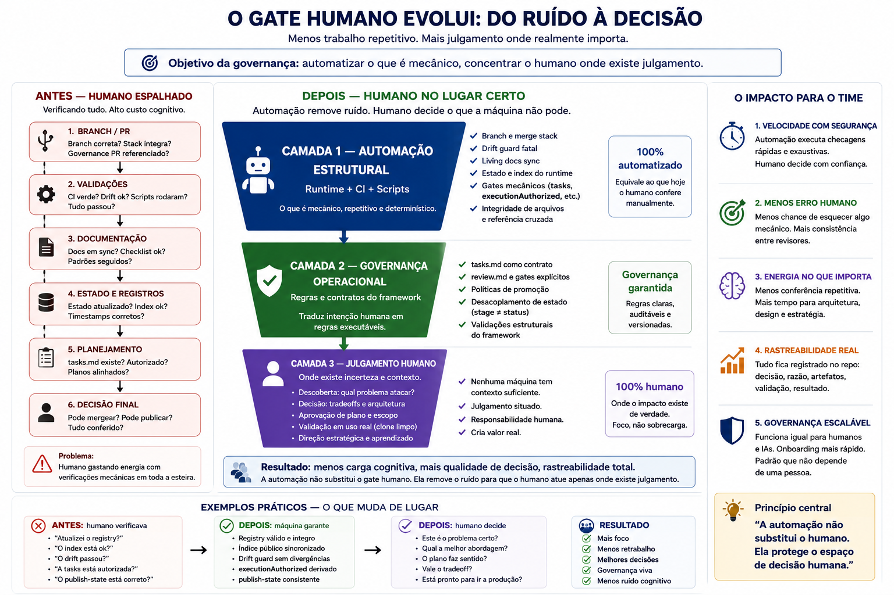

<!-- ai-guidelines-template: spec-boilerplate v=1 -->

# Spec 0024 — Context Architecture (Arquitetura Canônica de Preservação, Promoção, Seleção e Projeção de Contexto)

> Status: Draft
> Author: Rosana Rezende + Claude Sonnet 4.6 + ChatGPT (tri-party, sessão 2026-05-28)
> Date: 2026-05-28
> Owner: Rosana Rezende
> Tipo de spec: evidence-driven
> Decision Brief: [`./decision-brief.md`](./decision-brief.md)
> Plan: [`./plan.md`](./plan.md)

> **Princípio de imutabilidade:** após status `In Review`, este arquivo só
> muda por consenso explícito. Decisões em aberto vão para `decision-brief.md`.
>
> **Slug renomeado (2026-05-30).** O diretório e a branch foram migrados de `0024-handoff-as-first-class` para **`0024-context-architecture`** (operação deliberada, sob autorização explícita da owner) — refletindo que a 0024 deixou de ser sobre handoff e passou a ser a **arquitetura de contexto**. O **número 0024 é imutável** (ADR 0017); apenas o slug mudou. O retarget do PR #30 acompanha o rename remoto da branch.

> ## 🔁 Nota de fase — ABSORÇÃO OPERACIONAL (2026-05-31, Checkpoint 2 · vocabulário no Checkpoint 2.1)
>
> **Esta nota reposiciona a spec sem reescrever o corpo abaixo.** Tudo a partir de _"Visão arquitetural"_ é **registro histórico** do enquadramento research-first (2026-05-28/29) e é preservado verbatim (princípio de imutabilidade + `sem apagar histórico`). O **estado vigente** é o desta nota.
>
> - **A pesquisa (Stage 1) encerrou; a 0024 entrou em absorção operacional.** Conclusão-raiz: _o problema não é falta de decisão — é falta de absorção._ As decisões convergidas ainda não alteraram o comportamento do sistema ("a arquitetura converge enquanto o código diverge"). O trabalho agora é **remover divergências decisão↔código uma a uma**, não re-modelar.
> - **Decisões cravadas (`decision-brief.md`, reestruturado por estado):** `[DEC-0024-G00]` identidade (transformação `contexto humano → governança executável`), `[DEC-0024-G02]` taxonomia de tipos removida (→ bloco + propriedade `exige-julgamento`), `[DEC-0024-G06]` contrato da cadeia — todas **`Resolved`**. **Gate fechado.** `state.yml` = `stage: implementation` / `gate.status: closed`.
> - **Pesquisa estrutural ainda aberta** (ex-`G01`/`G03`/`G04`/`G05` + eixos de pressão) **não bloqueia** — migrou para [`research/findings.md`](./research/findings.md) como _findings abertos_; só retorna ao brief como `[DEC] Pendente` ao convergir + exigir julgamento.
> - **Vocabulário (Checkpoint 2.1):** **PR/`#N`** = Pull Request real do GitHub · **Checkpoint N** = unidade de implementação da spec · **Gate** = ritual de validação (Technical Audit → Architectural Review → Human). Glossário canônico em [`plan.md § Glossário`](./plan.md).
> - **Plano executável = `plan.md`.** A sequência de Checkpoints de absorção (backlog = relatório de auditoria do Codex) foi **dobrada no [`plan.md`](./plan.md)** no Checkpoint 2, aposentando a dependência de arquivo local efêmero. Cada Checkpoint é atômico/reversível, fechado por um **Gate** (Technical Audit → Architectural Review → Human). **Topologia:** `#32` é o PR de governança/bootstrap (Checkpoint 1/2/2.1) e encerra; do **Checkpoint 3** em diante, cada um abre **PR real próprio** (sequential, ADR 0024).
> - **Sobre `Tipo de spec: evidence-driven` (header abaixo):** é **metadado histórico**. A própria taxonomia `deterministic/mixed/evidence-driven` foi **removida** por `[DEC-0024-G02]`; sua eliminação do runtime/boilerplate é **execução derivada** (Checkpoints de absorção, ex.: Checkpoint 7/Checkpoint 10), **não** ocorre nesta nota. O rótulo é preservado como registro, não como classificação ativa.
> - **Critérios de Aceite (alto nível) abaixo:** redigidos para o ciclo research-first; o ciclo de absorção é regido pelo DoD operacional do [`plan.md`](./plan.md) e pelo checklist de Checkpoints do [`tasks.md`](./tasks.md). Permanecem válidos como registro do que a fase de pesquisa exigiu.

---

## 🧭 Visão arquitetural (norte)

> **Norte arquitetural — não é requisito nem evidência.** Esta imagem representa o **estado-alvo** que a 0024 viabiliza e serve de lente para futuras decisões. Três camadas:
>
> - **CAMADA 1 — Automação Estrutural** (CI + runtime + scripts): absorve o trabalho mecânico (drift, living-docs, gates determinísticos).
> - **CAMADA 2 — Governança Operacional** (regras e **contratos** do framework): organiza responsabilidade — _é onde vive o contrato da cadeia `research → … → implementação` cravado por esta spec._
> - **CAMADA 3 — Julgamento Humano**: o humano atua **apenas onde existe julgamento**.
>
> **Princípio central:** _a automação não substitui o humano; ela protege o espaço de decisão humana._ O contrato da cadeia (CAMADA 2) é pré-requisito da CAMADA 1 de decisão — você não automatiza o que ainda não foi definido (cf. `NEXT.md #9`: 1º candidato de CAMADA 1 = `decision-trace:check`).

---

## 🎯 Objetivo

O framework `ai-guidelines` consolidou-se como **governance-first** (ADR 0018), entregou o runtime operacional (Spec 0023), e absorveu o princípio de **bootstrap situado** (ADR 0022 — Aceita 2026-05-28). Durante o fechamento da Spec 0023 e a sessão de planejamento desta spec, uma formulação progressivamente mais profunda do problema emergiu da operação real, em cadeia causal:

> `handoff → o que selecionar → quem decide → como algo vira regra → qual é a unidade promovível → como o lifecycle é modelado → como os boilerplates codificam esse lifecycle`.

A conclusão (decisão da owner, 2026-05-29): **o objeto da 0024 não é handoff. É a arquitetura canônica de preservação, promoção, seleção e projeção de contexto do `ai-guidelines`.** Handoff é apenas uma das projeções (ao lado de wizard, `AGENTS.md`, dashboard, briefing). O problema central segue sendo **seleção/governança de contexto, não memória** — mas a spec foi elevada de "uma projeção" para **o modelo fundacional do qual as projeções derivam**.

> **Esta é uma spec de implementação orientada por evidências, não research-only.** A pesquisa (Stage 1) é uma **fase** da 0024, não seu produto. Fluxo: `research → decision-brief → gate humano → plan v2 → tasks v2 → implementação (Stage 2)`, **tudo dentro da própria 0024**. Um split estrutural `0024 → 0025` **não é pressuposto**; só seria considerado se a research revelar mudança de direção relevante no problema.

> **Fronteira canônica desta spec — modelo ≠ migração.** A 0024 **decide o modelo** (unidade primária de modelagem, papel dos 7 pilares MECE, taxonomia de specs, contrato mínimo de boilerplate, modelo de projeção, contratos de handoff). A 0024 **não migra o ecossistema** (retrofit de todos os boilerplates, consolidação tri-root, atualização em massa de examples/docs). A migração é faseada: ≥ 1 artefato de referência dentro da 0024 (Stage 2) + execução ampla nas candidatas re-escopadas. **A implementação de referência tem caráter de validação arquitetural — seu objetivo é provar o modelo decidido. Ela NÃO constitui autorização para retrofit em massa do ecossistema nem substitui as candidatas de migração identificadas no Grupo B.** Classificação em [`research/2026-05-29-architectural-inventory.md`](./research/2026-05-29-architectural-inventory.md).

Resultado esperado quando esta spec encerrar:

- Decision-brief com o **Bloco G — Arquitetura Fundacional** (`G00` unidade primária _(raiz)_, `G01` 7 pilares MECE, `G02` taxonomia de specs, `G03` promotion pipeline, `G04` contrato de boilerplate + _core_, `G05` modelo de projeção) + os 5 eixos (A Seleção / B Persistência / D Promoção / E Projeção / F Governança) `Resolved` por evidência (**Fonte A** auditoria interna + **Fonte B** research externa).
- `plan.md` v2 cravando o design técnico derivado linearmente das decisões, ancorado em `[DEC-0024-*]`.
- `tasks.md` v2 com tasks de Stage 2 (implementação dentro da 0024, faseada em PRs como na Spec 0023).
- **Implementação de referência entregue**: handoff como projeção + ≥ 1 boilerplate/example provando o contrato `G04`.
- Análise comparativa em `research/` (convergências/divergências entre sistemas externos e a leitura governance-first).

---

## 📦 Escopo

### Dentro do escopo

- **Camada fundacional (Bloco G — Arquitetura Fundacional)**: unidade primária de modelagem (`G00`, raiz), papel dos 7 pilares MECE / ADR 0010 (`G01`), validade da taxonomia de tipos de spec (`G02`), promotion pipeline (`G03`), contrato mínimo de boilerplate + _core_ comum (`G04`), modelo de projeção SSOT→N consumidores (`G05`). **Decisão de modelo, não migração.**
- **Inventário arquitetural** (`research/2026-05-29-architectural-inventory.md`): classificação do backlog em Grupo A (fundacional, entra) / B (derivado, faseado) / C (independente, fica).
- **Stage 1 (Research)**: investigação dos eixos via comparação com sistemas existentes (Hermes Agent, OpenCloud/OpenCode, Cursor SDK, Anthropic Dreaming in Cloud, Spec Kitty, e sistemas baseados em grafos quando referência específica for recuperada). O Bloco G exige **Fonte A (auditoria interna) + Fonte B (research externa)**.
- **Bloco A — Síntese empírica (preâmbulo)**: observações cravadas desta sessão e do fechamento da Spec 0023 como evidência inicial.
- **Blocos por eixo (Seleção / Persistência / Promoção / Projeção / Governança)**: cada eixo vira bloco de DECs com perguntas abertas no início; opções populadas conforme research consolidar. **Nenhuma DEC de A-F estabiliza enquanto `G00` não estiver `Resolved`** (invariante de ordem).
- **Bloco Saúde Técnica (mandatório)**: análise de saúde dos componentes de runtime tocados pela implementação derivada (escopo emerge da própria research).
- **`research/` artifacts**: inventário; matriz comparativa sistemas × eixos; análise per-fonte; síntese final.
- **Critério de saída da research** declarado: cada eixo (A-F) com ≥ 1 resposta evidence-backed; ≥ 2 sistemas convergem em ≥ 2 respostas; **Bloco G fechado (`G00`-`G05` `Resolved` com Fonte A + B)**; Bloco A com ≥ 3 observações cravadas.
- **Stage 2 (Design + Implementação), dentro da 0024**: após o gate, `plan.md` v2 + `tasks.md` v2 + a implementação de referência (handoff + boilerplate de referência), faseada em PRs como na Spec 0023.
- **Gate humano** fecha decision-brief; `plan.md` v2 + `tasks.md` v2 derivam linearmente das decisões cravadas.

### Fora do escopo (migração/execução — faseada ou em outra spec)

- **Migração do ecossistema (Grupo B do inventário)** — retrofit de todos os boilerplates, consolidação tri-root (execução), atualização em massa de examples/quickstarts/docs, distribuição para providers. A 0024 entrega **só o artefato de referência**; a migração ampla é faseada nas candidatas re-escopadas (`boilerplate-system-modernization`, `runtime-and-template-root-consolidation`). **Fronteira modelo ≠ migração.**
- **Itens independentes (Grupo C do inventário)** — dashboard, telemetria, coverage-rigor, wizard-scaling, harness etc.: consumidores da arquitetura, não fundação. Nenhum é absorvido.
- **Split estrutural `0024 → 0025` como pressuposto** — _retirado_ (decisão da owner, 2026-05-29). A implementação é entregue **dentro da 0024** (Stage 2). Abrir uma 0025 só entra em pauta se a research revelar mudança de direção relevante.
- **Re-modeling de domínio/registry (`WorkItemKind`, schema de persistência)** caso `G00` mude a unidade primária — Grupo B / faseado; a 0024 crava o modelo, não reescreve o domínio no mesmo ciclo.
- **`AGENTS.md` raiz como projeção** — sua reorganização/fragmentação (`regra-hierarquia`, Grupo B) fica faseada; o _modelo_ de projeção é `G05`.
- **Cutover dos stubs por canal** (`.cursorrules`, `CLAUDE.md`, `.github/copilot-instructions.md` reduzidos a ≤ 10 linhas): adiamento intencional — exige handoff implementado primeiro. Per ADR 0022, é "consequência de médio prazo".
- **Memory engine implícito / vector store / graph database** — viola o framing "seleção, não memória"; explicitamente fora.
- **Auto-promoção de padrões a regras pelo agente** — viola ADR 0018 + ADR 0022 + framing "governança como autoridade".
- **Dashboard / HTML como SSOT** — escopo de `governance-dashboard-and-visual-artifacts` (Grupo C); herda anti-paper de ADR 0023.
- **Substituição do `workflow continue` resumido** — handoff é boot frio; continue é continuação intra-fluxo. São complementares.

---

## ✅ Critérios de Aceite (alto nível)

- [ ] Inventário arquitetural (`research/2026-05-29-architectural-inventory.md`) publicado e classificação validada no gate.
- [ ] **Bloco G — Arquitetura Fundacional `Resolved`** (`G00`-`G05`), cada DEC com evidência **Fonte A + Fonte B**; `G00` resolvida **antes** de estabilizar A-F.
- [ ] `research/` contém artifacts comparativos cobrindo os sistemas declarados em escopo.
- [ ] Matriz pressão × sistema preenchida com evidência para cada célula relevante.
- [ ] Critério de saída satisfeito (≥ 1 resposta por eixo A-F; ≥ 2 sistemas convergem em ≥ 2 respostas; **Bloco G fechado**; Bloco A com ≥ 3 observações cravadas).
- [ ] `decision-brief.md` `Resolved` em todos os blocos (G + A-F + Saúde Técnica); Bloco A populado e estável.
- [ ] `plan.md` v2 publicado: design técnico derivado linearmente das decisões; cada subseção cita `[DEC-0024-XYZ]` ancorante.
- [ ] `tasks.md` v2 publicado: tasks operacionais Stage 2 derivadas do plan v2.
- [ ] **Implementação de referência entregue dentro da 0024** (handoff como projeção + ≥ 1 boilerplate/example provando o contrato `G04`); cada decisão fundacional gerou ≥ 1 artefato implementável (guardrail anti-"super ADR").
- [ ] Pipeline `yarn format ; yarn validate` verde.
- [ ] PR Draft revisado e aprovado por humano antes de Ready.
- [ ] **Fronteira modelo ≠ migração** auditada no encerramento: nenhum item Grupo B/C foi executado em massa dentro da 0024.
- [ ] Não-objetivos cravados continuam respeitados ao longo de todo o ciclo (auditoria final no encerramento).

---

## 🔬 Pesquisa de contexto

- [`./decision-brief.md`](./decision-brief.md) — gate humano de decisões pré-design; estruturado pelos 5 eixos.
- [`./research/2026-05-28-pressure-axes-scope.md`](./research/2026-05-28-pressure-axes-scope.md) — define os 5 eixos + matriz vazia + critério de saída.
- [`./research/2026-05-28-this-session-as-evidence.md`](./research/2026-05-28-this-session-as-evidence.md) — captura a sessão de planejamento desta spec (tri-party emergente) como primeiro evidence artifact.
- Spec 0021 — fundação governance-first (`AGENTS.md` como output runtime, não autoridade SSOT sprawling).
- Spec 0023 — entregou runtime operacional (state.yml, wizard, governance-pr-check); evidência empírica que motivou ADR 0022.
- ADR 0018 — `governance-first, AI-as-Channel`: nenhum LLM no runtime; restrição arquitetural canônica.
- ADR 0022 — `Handoff situado em estado precede distribuição pré-carregada` (Aceita 2026-05-28); fundamento ontológico desta spec.

---

## 🧠 Decisão de Fusão

`handoff-as-first-class` já era entry consolidada do backlog (absorveu "Arquitetura de regras portáveis vs. contexto framework-interno" em 2026-05-22). Com a elevação a spec fundacional (2026-05-29), a 0024 **absorve as camadas-modelo (Grupo A) de três candidatas parcialmente sobrepostas** — `boilerplate-system-modernization` (taxonomia, contrato + core), `runtime-and-template-root-consolidation` (definição de lar canônico / precedência / ownership) e `handoff-contracts-formalization` (contratos de continuidade) — porque o inventário arquitetural mostrou que parte relevante delas é sintoma da **mesma lacuna fundacional**. As **camadas de execução/migração (Grupo B)** dessas candidatas permanecem nelas, re-escopadas. Cf. [`research/2026-05-29-architectural-inventory.md`](./research/2026-05-29-architectural-inventory.md).

`governance-dashboard-and-visual-artifacts` é **Grupo C** (consumidor da arquitetura, não fundação): **poderá consumir os resultados da 0024, mas permanece fora do escopo desta spec salvo reclassificação arquitetural explícita posterior** — não há porta de fusão aberta que contradiga a classificação do inventário.

---

## 🛠️ Dependências e impactos (alto nível)

- **Pré-requisitos:**
  - Spec 0023 mergeada ✅
  - ADR 0022 Aceita ✅ (PR #29, 2026-05-28)
- **Specs afetadas:**
  - `governance-dashboard-and-visual-artifacts` (backlog Now §2) — pode ganhar ou perder relevância dependendo do que a research desta spec revelar sobre projeções multi-consumidor.
  - `boilerplate-system-modernization` (backlog Now §3) — pode ganhar requisito derivado se boilerplates precisarem instrumentar handoff/projection points.
- **Cross-refs com specs irmãs:**
  - **Spec 0023** — fronteira: 0023 entregou runtime operacional (lookup + estado + wizard); 0024 investiga como o runtime decide o que projetar para quem. Motivo: 0023 era operação; 0024 é seleção/projeção governada.
- **Riscos macro:**
  - **Spec deriva para memory systems** — perde framing "seleção como problema, governança como restrição". Mitigação: não-objetivos cravados; auditoria contínua no Bloco B (Persistência) para garantir que "o que persiste" não vira "como persistir".
  - **Spec congela ontologia cedo demais** — pesquisar features em vez de pressões arquiteturais. Mitigação: research estruturada por eixos (não por sistemas), com critério de saída explícito.
  - **"4ª camada" de contexto sem desativar a 2ª** — risco herdado da entry de backlog. Mitigação: política de migração obrigatória declarada quando spec implementadora (0025?) abrir.

Detalhamento técnico (riscos por componente, mitigações) emerge no `plan.md` v2 pós-gate.

---

## 📚 Referências

- Specs relacionadas: **0021** (governance-first foundation), **0023** (runtime operacional).
- ADRs aplicáveis: **ADR 0010** (taxonomia MECE de 7 pilares — fundamento de `G01`), **ADR 0014** (validação estrutural por gênero de artefato), **ADR 0017** (slug semântico até branch; número imutável — base do rename), **ADR 0018** (AI-as-Channel; restritivo), **ADR 0022** (handoff situado precede distribuição; fundamento), **ADR 0023** (meta-artefatos YAML SSOT; aplicável a projeções tipo dashboard). Processo: [`governance-foundation.md` § "Tipos de spec"](../../../.core/process/governance-foundation.md) — fonte da taxonomia que `G02` audita.
- Evidência empírica externa (vídeos comparativos sobre Hermes Agent, Cursor SDK, Open Code, HTML vs Markdown): URLs canônicas e síntese estruturada em [`./research/2026-05-28-pressure-axes-scope.md § Fontes primárias citáveis`](./research/2026-05-28-pressure-axes-scope.md). Transcrições brutas mantidas localmente em `temp/` durante o ciclo da spec (não-versionadas por copyright; cobertas em `.gitignore`).
- Sessão de planejamento 2026-05-28 — branch `feat/spec-0024-context-architecture`, commits desta spec; tri-party Rosana + Claude + ChatGPT registrado em `research/2026-05-28-this-session-as-evidence.md`.
